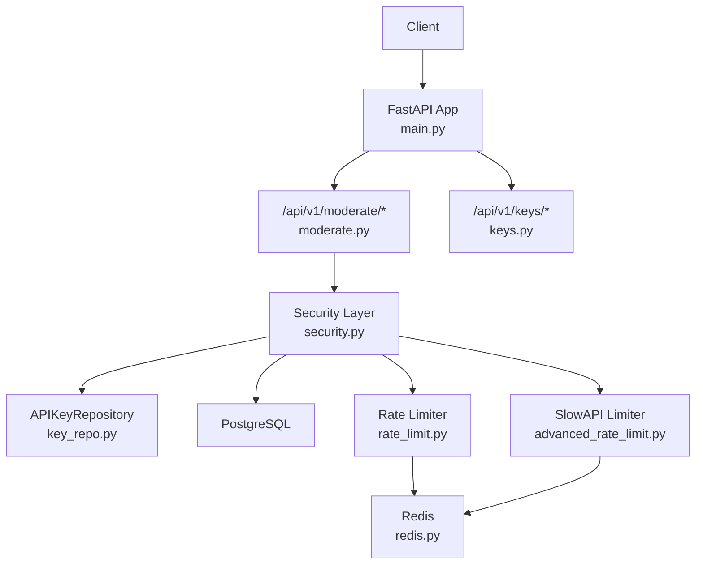
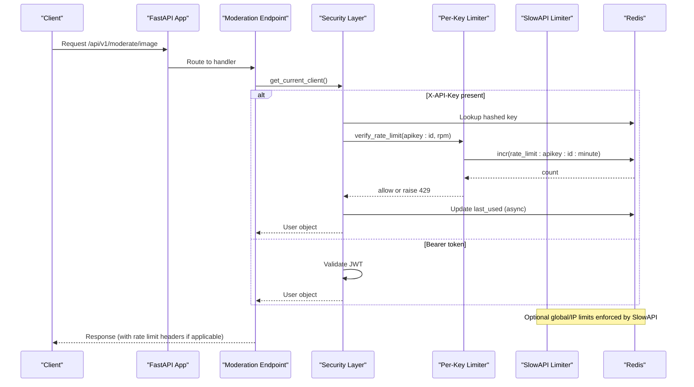
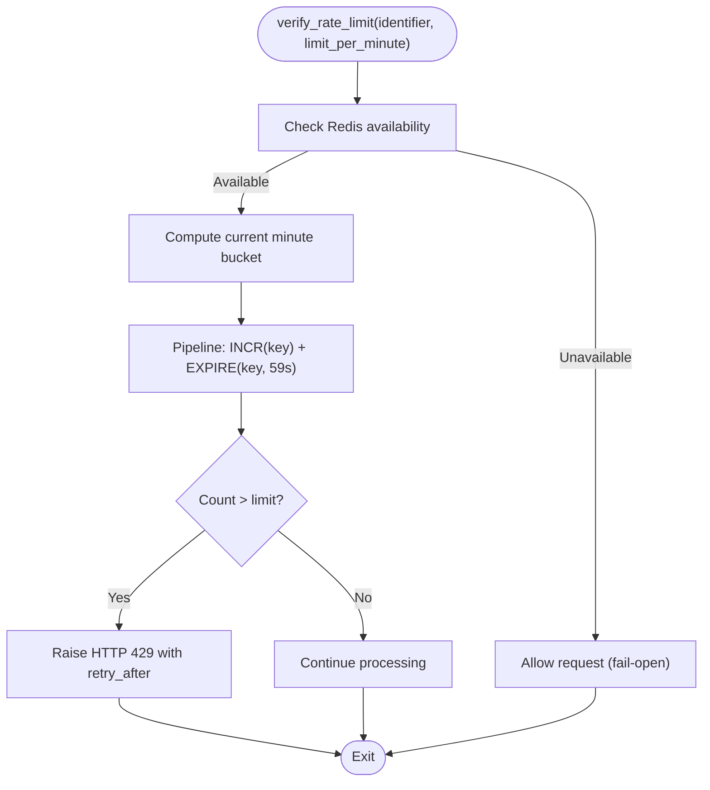
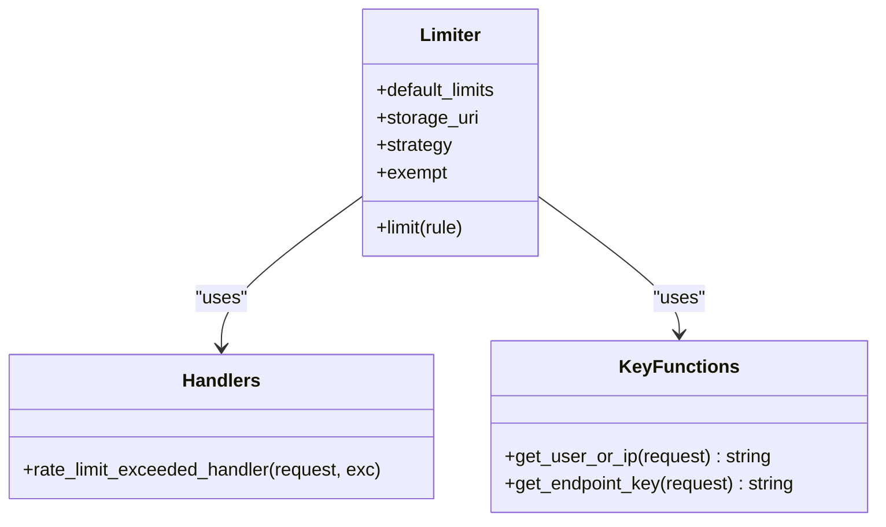
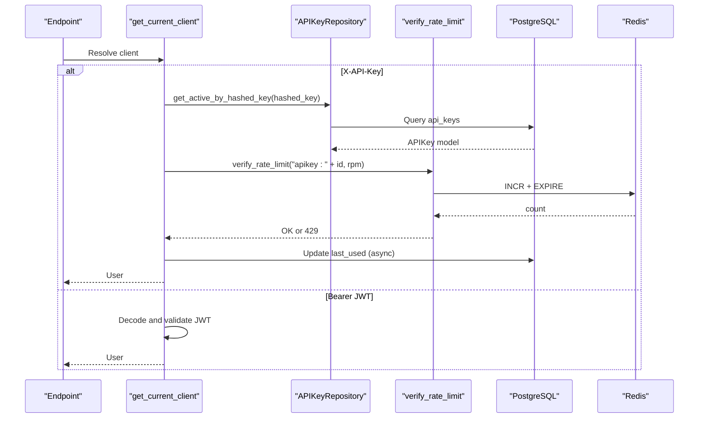
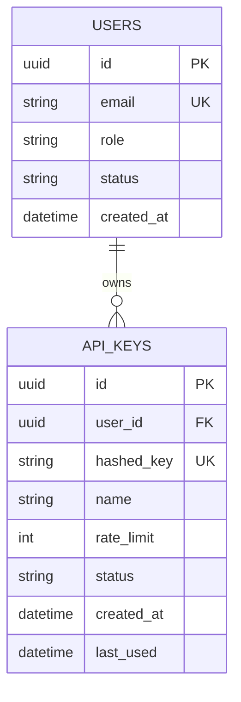
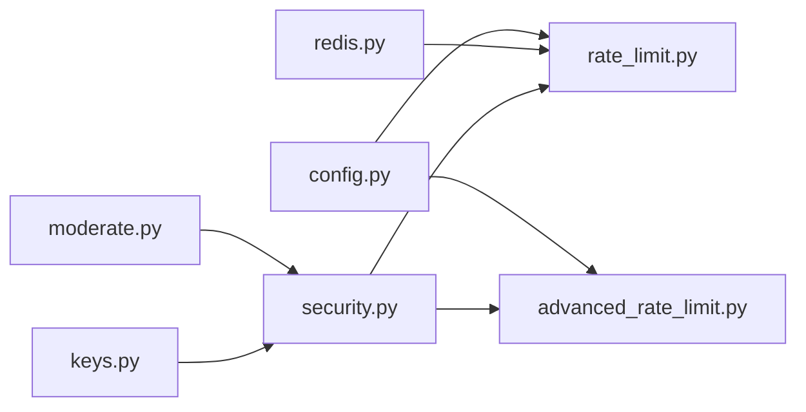

# Rate Limiting & Abuse Prevention

<cite>
**Referenced Files in This Document**
- [rate_limit.py](file://backend/app/core/rate_limit.py)
- [advanced_rate_limit.py](file://backend/app/core/advanced_rate_limit.py)
- [redis.py](file://backend/app/core/redis.py)
- [config.py](file://backend/app/core/config.py)
- [security.py](file://backend/app/core/security.py)
- [key.py](file://backend/app/models/key.py)
- [keys.py](file://backend/app/api/keys.py)
- [moderate.py](file://backend/app/api/moderate.py)
- [main.py](file://backend/app/main.py)
- [README.md](file://README.md)
</cite>

## Table of Contents
1. [Introduction](#introduction)
2. [Project Structure](#project-structure)
3. [Core Components](#core-components)
4. [Architecture Overview](#architecture-overview)
5. [Detailed Component Analysis](#detailed-component-analysis)
6. [Dependency Analysis](#dependency-analysis)
7. [Performance Considerations](#performance-considerations)
8. [Troubleshooting Guide](#troubleshooting-guide)
9. [Conclusion](#conclusion)
10. [Appendices](#appendices)

## Introduction
This document explains the OmniShield rate limiting and abuse prevention system that protects API resources from malicious usage. It covers:
- Redis-backed per-user and per-API key rate limiting with minute-windowed counters
- Distributed enforcement across multiple application instances via shared Redis
- Tier-based quotas (Free, Pro, Enterprise) and how they map to configuration and API keys
- Advanced IP-based limits using SlowAPI with Redis storage
- Response headers and HTTP 429 behavior for clients
- Configuration examples, monitoring guidance, and extensibility points for custom strategies

## Project Structure
The rate limiting features are implemented across core modules and integrated into authentication and API endpoints:
- Core rate limiter: minute-windowed counters stored in Redis
- Advanced limiter: SlowAPI-based IP/user/key-scoped limits with Redis backend
- Security layer: resolves client identity (JWT or API key), enforces per-key RPM
- Models and repositories: store API keys and their per-key RPM settings
- API endpoints: protected by security dependency which applies per-key limits
- Application bootstrap: registers routers and optional metrics endpoint

**Diagram sources**
- [main.py:59-63](file://backend/app/main.py#L59-L63)
- [moderate.py:12](file://backend/app/api/moderate.py#L12)
- [security.py:119-150](file://backend/app/core/security.py#L119-L150)
- [rate_limit.py:7-44](file://backend/app/core/rate_limit.py#L7-L44)
- [redis.py:1-21](file://backend/app/core/redis.py#L1-L21)
- [advanced_rate_limit.py:15-21](file://backend/app/core/advanced_rate_limit.py#L15-L21)

**Section sources**
- [main.py:59-63](file://backend/app/main.py#L59-L63)
- [moderate.py:12](file://backend/app/api/moderate.py#L12)
- [security.py:119-150](file://backend/app/core/security.py#L119-L150)
- [rate_limit.py:7-44](file://backend/app/core/rate_limit.py#L7-L44)
- [redis.py:1-21](file://backend/app/core/redis.py#L1-L21)
- [advanced_rate_limit.py:15-21](file://backend/app/core/advanced_rate_limit.py#L15-L21)

## Core Components
- Per-key minute window rate limiter:
  - Uses a Redis counter keyed by identifier and current minute
  - Atomic increment + TTL via pipeline; fails open if Redis is unavailable
  - Returns HTTP 429 with retry-after guidance when exceeded
- SlowAPI advanced limiter:
  - Stores limits in Redis with fixed-window strategy
  - Provides decorators for public/authenticated/admin tiers
  - Custom handler returns structured JSON and standard rate limit headers
- Security integration:
  - Resolves client identity via X-API-Key or Authorization Bearer JWT
  - Enforces per-API key RPM using the per-key limiter
  - Updates last-used timestamp asynchronously
- Configuration:
  - Default and admin RPM values loaded from settings
  - Redis URL used by both custom limiter and SlowAPI

**Section sources**
- [rate_limit.py:7-44](file://backend/app/core/rate_limit.py#L7-L44)
- [advanced_rate_limit.py:15-49](file://backend/app/core/advanced_rate_limit.py#L15-L49)
- [security.py:119-150](file://backend/app/core/security.py#L119-L150)
- [config.py:84-86](file://backend/app/core/config.py#L84-L86)
- [redis.py:1-21](file://backend/app/core/redis.py#L1-L21)

## Architecture Overview
The system combines two complementary layers:
- Per-client (per-API key) enforcement at the security layer
- Global/per-IP enforcement via SlowAPI middleware/decorators

**Diagram sources**
- [moderate.py:12](file://backend/app/api/moderate.py#L12)
- [security.py:153-176](file://backend/app/core/security.py#L153-L176)
- [security.py:119-150](file://backend/app/core/security.py#L119-L150)
- [rate_limit.py:7-44](file://backend/app/core/rate_limit.py#L7-L44)
- [advanced_rate_limit.py:15-49](file://backend/app/core/advanced_rate_limit.py#L15-L49)

## Detailed Component Analysis

### Redis-Based Minute Window Rate Limiter
- Purpose: Enforce per-identifier RPM using a sliding minute window
- Algorithm:
  - Compute current minute bucket
  - Increment counter atomically and set TTL to expire at minute boundary
  - If count exceeds limit, raise HTTP 429 with retry_after seconds until next minute
- Failure mode: If Redis is down, requests are allowed (fail-open)
- Headers: The custom handler sets Retry-After and includes limit details in response body

**Diagram sources**
- [rate_limit.py:7-44](file://backend/app/core/rate_limit.py#L7-L44)
- [redis.py:1-21](file://backend/app/core/redis.py#L1-L21)

**Section sources**
- [rate_limit.py:7-44](file://backend/app/core/rate_limit.py#L7-L44)
- [redis.py:1-21](file://backend/app/core/redis.py#L1-L21)

### SlowAPI Advanced Limiter (IP/User/Endpoint Scoping)
- Storage: Redis-backed fixed-window strategy
- Defaults:
  - Public tier uses DEFAULT_RATE_LIMIT_PER_MINUTE
  - Authenticated tier uses double the default
  - Admin tier uses ADMIN_RATE_LIMIT_PER_MINUTE
- Custom handler:
  - Returns JSON with error, message, detail, retry_after
  - Adds standard headers: Retry-After, X-RateLimit-Limit, X-RateLimit-Remaining, X-RateLimit-Reset
- Key functions:
  - get_user_or_ip: prioritizes user ID from JWT, then API key prefix, then IP
  - get_endpoint_key: scopes limits per endpoint path

**Diagram sources**
- [advanced_rate_limit.py:15-49](file://backend/app/core/advanced_rate_limit.py#L15-L49)
- [advanced_rate_limit.py:73-112](file://backend/app/core/advanced_rate_limit.py#L73-L112)

**Section sources**
- [advanced_rate_limit.py:15-49](file://backend/app/core/advanced_rate_limit.py#L15-L49)
- [advanced_rate_limit.py:73-112](file://backend/app/core/advanced_rate_limit.py#L73-L112)

### Security Layer Integration (Per-API Key Enforcement)
- Identity resolution:
  - Prefers X-API-Key header; falls back to Authorization Bearer JWT
- Per-key enforcement:
  - Validates active API key
  - Applies per-key RPM via verify_rate_limit
  - Asynchronously updates last_used timestamp
- Returns owner user context for downstream handlers

**Diagram sources**
- [security.py:153-176](file://backend/app/core/security.py#L153-L176)
- [security.py:119-150](file://backend/app/core/security.py#L119-L150)
- [rate_limit.py:7-44](file://backend/app/core/rate_limit.py#L7-L44)

**Section sources**
- [security.py:153-176](file://backend/app/core/security.py#L153-L176)
- [security.py:119-150](file://backend/app/core/security.py#L119-L150)

### API Keys Model and Repository
- Model fields:
  - id, user_id, hashed_key, name, rate_limit (RPM), status, timestamps
- Repository capabilities:
  - Generate secure raw keys prefixed with ak_
  - Hash keys with SHA256 for storage
  - Create, list, revoke keys
  - Fetch active keys by hashed value

**Diagram sources**
- [key.py:9-23](file://backend/app/models/key.py#L9-L23)
- [user.py:10-28](file://backend/app/models/user.py#L10-L28)

**Section sources**
- [key.py:9-23](file://backend/app/models/key.py#L9-L23)
- [keys.py:14-38](file://backend/app/api/keys.py#L14-L38)
- [key_repo.py:10-79](file://backend/app/repositories/key_repo.py#L10-L79)

### Endpoint Usage and Protection
- Moderation endpoints depend on get_current_client, ensuring per-key RPM enforcement for API key users
- Public endpoints can be decorated with SlowAPI helpers to enforce IP-level limits

**Section sources**
- [moderate.py:12](file://backend/app/api/moderate.py#L12)
- [advanced_rate_limit.py:52-70](file://backend/app/core/advanced_rate_limit.py#L52-L70)

## Dependency Analysis
- Core dependencies:
  - rate_limit.py depends on redis.py for connection and availability
  - security.py imports verify_rate_limit and integrates it into client resolution
  - advanced_rate_limit.py initializes SlowAPI with Redis storage URI from config
  - config.py provides default RPM values and Redis URL
- Coupling and cohesion:
  - Per-key limiter is cohesive and reusable across any authenticated flow
  - SlowAPI module encapsulates IP/user scoping and response formatting
  - Security layer centralizes identity resolution and enforcement orchestration

**Diagram sources**
- [config.py:84-86](file://backend/app/core/config.py#L84-L86)
- [redis.py:1-21](file://backend/app/core/redis.py#L1-L21)
- [rate_limit.py:7-44](file://backend/app/core/rate_limit.py#L7-L44)
- [advanced_rate_limit.py:15-49](file://backend/app/core/advanced_rate_limit.py#L15-L49)
- [security.py:119-150](file://backend/app/core/security.py#L119-L150)
- [moderate.py:12](file://backend/app/api/moderate.py#L12)
- [keys.py:14-38](file://backend/app/api/keys.py#L14-L38)

**Section sources**
- [config.py:84-86](file://backend/app/core/config.py#L84-L86)
- [redis.py:1-21](file://backend/app/core/redis.py#L1-L21)
- [rate_limit.py:7-44](file://backend/app/core/rate_limit.py#L7-L44)
- [advanced_rate_limit.py:15-49](file://backend/app/core/advanced_rate_limit.py#L15-L49)
- [security.py:119-150](file://backend/app/core/security.py#L119-L150)
- [moderate.py:12](file://backend/app/api/moderate.py#L12)
- [keys.py:14-38](file://backend/app/api/keys.py#L14-L38)

## Performance Considerations
- Redis pipeline operations minimize round-trips for atomic increments and TTL setting
- Fail-open behavior ensures service availability when Redis is degraded
- Fixed-window strategy in SlowAPI is efficient but may allow slight bursts at window boundaries; consider sliding window if stricter control is needed
- Asynchronous last_used updates avoid blocking request paths
- Shared Redis enables distributed enforcement across multiple app instances

[No sources needed since this section provides general guidance]

## Troubleshooting Guide
- Redis connectivity issues:
  - Connection initialization logs warnings and disables rate limiting gracefully
  - Verify REDIS_URL and network reachability
- Unexpected 429 responses:
  - Check per-key RPM configured in API key creation
  - Inspect SlowAPI default and tier limits
  - Review Retry-After and X-RateLimit-* headers
- Misconfigured identifiers:
  - Ensure X-API-Key is provided for per-key enforcement
  - For JWT flows, confirm Authorization header format and valid tokens

**Section sources**
- [redis.py:1-21](file://backend/app/core/redis.py#L1-L21)
- [rate_limit.py:7-44](file://backend/app/core/rate_limit.py#L7-L44)
- [advanced_rate_limit.py:24-49](file://backend/app/core/advanced_rate_limit.py#L24-L49)
- [security.py:153-176](file://backend/app/core/security.py#L153-L176)

## Conclusion
OmniShield’s rate limiting combines precise per-API key enforcement with flexible IP/user scoping via SlowAPI. Both components use Redis for distributed state, ensuring consistent protection across multiple instances. The design supports tiered quotas through configuration and per-key settings, while providing clear client feedback via standardized headers and 429 responses. Extensibility points exist for adaptive throttling, reputation scoring, and automated blocking patterns.

[No sources needed since this section summarizes without analyzing specific files]

## Appendices

### Tier-Based Quotas Mapping
- Free tier: 60 requests/min (DEFAULT_RATE_LIMIT_PER_MINUTE)
- Pro tier: 300 requests/min (ADMIN_RATE_LIMIT_PER_MINUTE)
- Enterprise: custom limits via API key rate_limit field

**Section sources**
- [config.py:84-86](file://backend/app/core/config.py#L84-L86)
- [key.py:16](file://backend/app/models/key.py#L16)
- [README.md:420-433](file://README.md#L420-L433)

### Rate Limit Headers and 429 Behavior
- Standard headers:
  - Retry-After
  - X-RateLimit-Limit
  - X-RateLimit-Remaining
  - X-RateLimit-Reset
- 429 responses include retry_after guidance in body for per-key limiter

**Section sources**
- [advanced_rate_limit.py:24-49](file://backend/app/core/advanced_rate_limit.py#L24-L49)
- [rate_limit.py:31-39](file://backend/app/core/rate_limit.py#L31-L39)
- [README.md:428-433](file://README.md#L428-L433)

### Configuration Examples
- Environment variables:
  - REDIS_URL for both custom limiter and SlowAPI
  - DEFAULT_RATE_LIMIT_PER_MINUTE and ADMIN_RATE_LIMIT_PER_MINUTE for tiers
- Docker Compose example references Redis URLs for broker/backend and cache

**Section sources**
- [config.py:44-47](file://backend/app/core/config.py#L44-L47)
- [config.py:84-86](file://backend/app/core/config.py#L84-L86)
- [README.md:558-560](file://README.md#L558-L560)

### Monitoring and Observability
- Prometheus metrics endpoint enabled conditionally
- Structured logging via Loguru for rate limit events and errors

**Section sources**
- [main.py:98-107](file://backend/app/main.py#L98-L107)
- [rate_limit.py:30-44](file://backend/app/core/rate_limit.py#L30-L44)
- [advanced_rate_limit.py:30-33](file://backend/app/core/advanced_rate_limit.py#L30-L33)

### Extending to Adaptive Throttling and Reputation Scoring
- Add a pre-check before verify_rate_limit to compute dynamic limits based on system load or IP reputation
- Integrate an external reputation service and adjust effective RPM accordingly
- Persist reputation scores and throttle decisions in Redis for fast lookups

[No sources needed since this section proposes extensions not present in code]