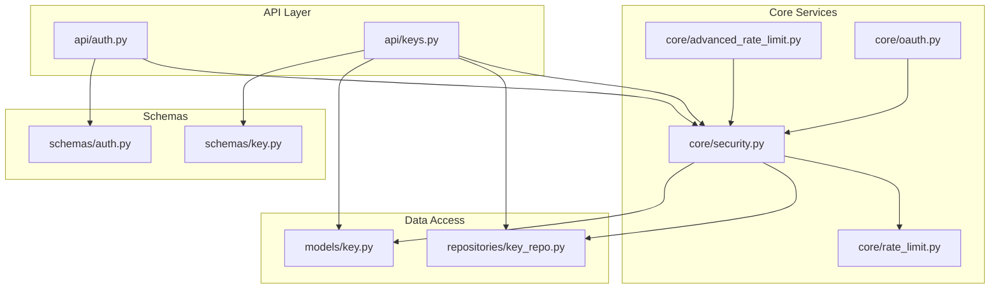
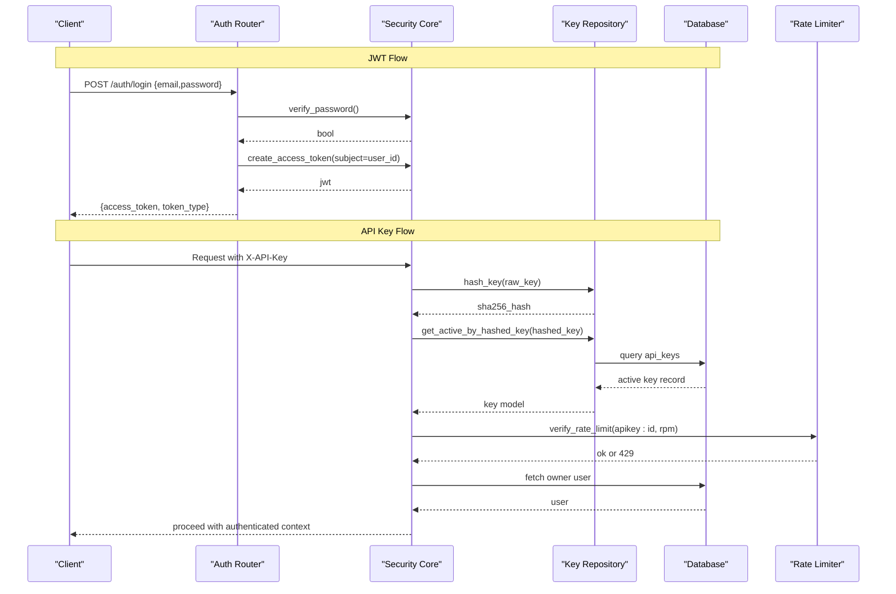
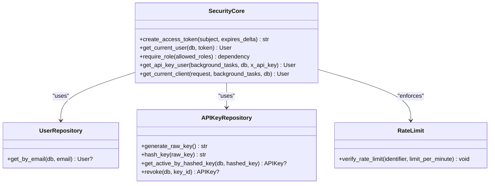
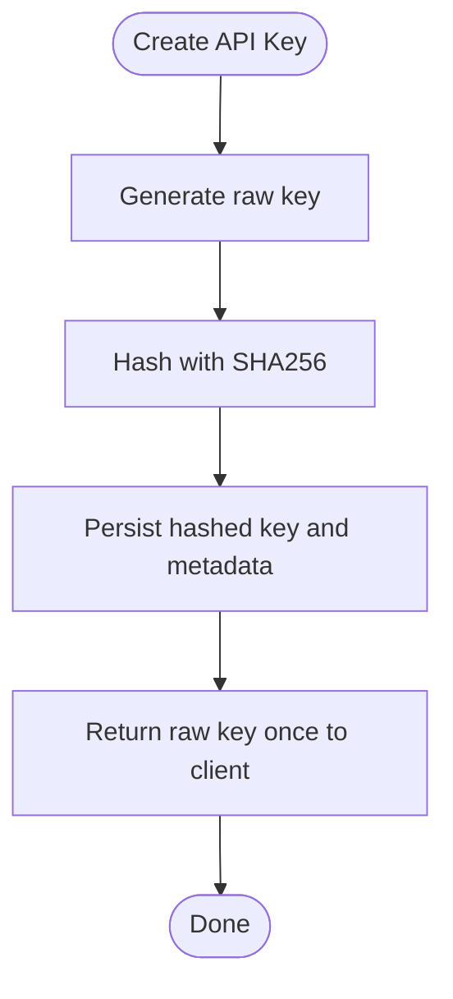
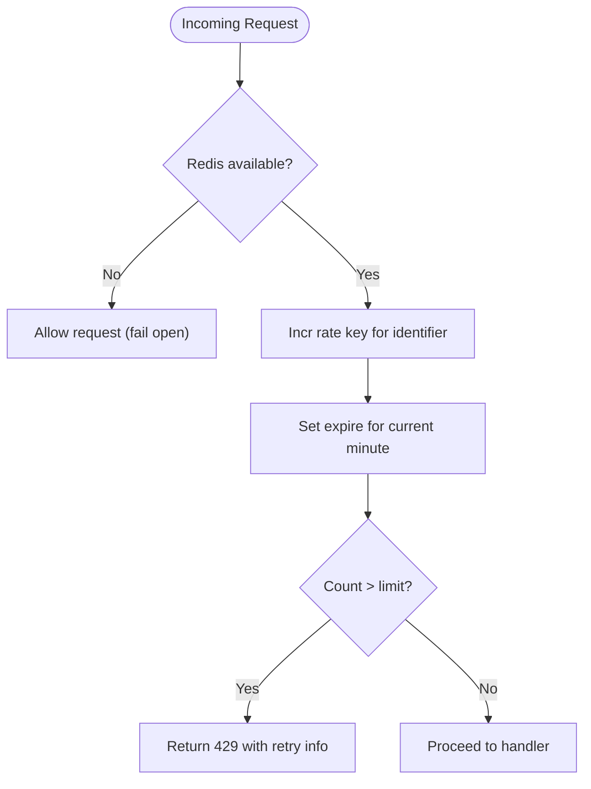
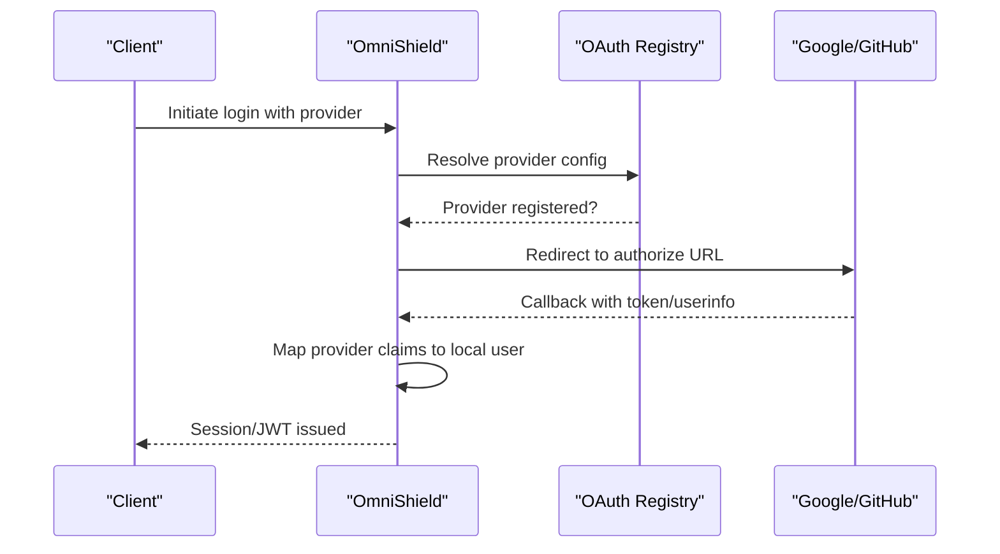
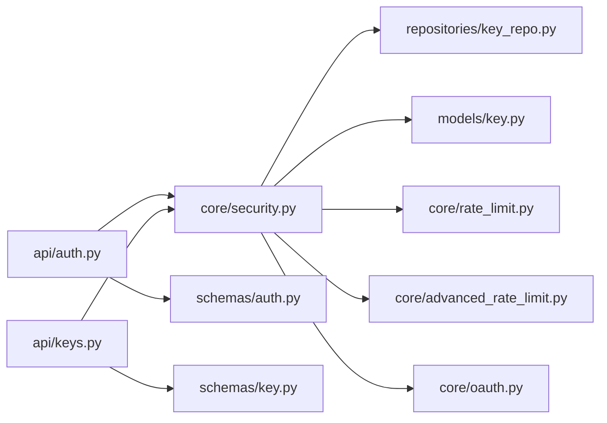

# Security & Authentication

<cite>
**Referenced Files in This Document**
- [auth.py](file://backend/app/api/auth.py)
- [keys.py](file://backend/app/api/keys.py)
- [security.py](file://backend/app/core/security.py)
- [rate_limit.py](file://backend/app/core/rate_limit.py)
- [advanced_rate_limit.py](file://backend/app/core/advanced_rate_limit.py)
- [oauth.py](file://backend/app/core/oauth.py)
- [key.py](file://backend/app/models/key.py)
- [key_repo.py](file://backend/app/repositories/key_repo.py)
- [auth.py](file://backend/app/schemas/auth.py)
- [key.py](file://backend/app/schemas/key.py)
</cite>

## Table of Contents
1. Introduction
2. Project Structure
3. Core Components
4. Architecture Overview
5. Detailed Component Analysis
6. Dependency Analysis
7. Performance Considerations
8. Troubleshooting Guide
9. Conclusion
10. Appendices

## Introduction
This document provides comprehensive security documentation for the OmniShield platform, focusing on authentication, authorization, and security implementation. It covers:
- Dual authentication system supporting JWT bearer tokens and API key authentication with bcrypt password hashing
- Token expiration handling and refresh token considerations
- API key management including generation with SHA256 hashing, role-based access control (RBAC), and key lifecycle management
- Rate limiting implementation with per-user and per-IP restrictions, burst handling, and tier-based quotas
- Input validation and sanitization for file uploads, XSS prevention via CSP headers, SQL injection protection through parameterized queries, and CSRF token implementation
- OAuth2 provider integration points for Google and GitHub
- Security best practices including HTTPS enforcement, secrets management, secure headers configuration, and vulnerability scanning
- Security testing guidelines, penetration testing considerations, and compliance requirements for enterprise deployments

## Project Structure
The security-relevant backend components are organized under app/core, app/api, app/models, app/repositories, and app/schemas. The primary entry points for authentication and authorization are FastAPI routers that depend on core security utilities and repositories.

**Diagram sources**
- [auth.py:1-90](file://backend/app/api/auth.py#L1-L90)
- [keys.py:1-87](file://backend/app/api/keys.py#L1-L87)
- [security.py:1-177](file://backend/app/core/security.py#L1-L177)
- [rate_limit.py:1-44](file://backend/app/core/rate_limit.py#L1-L44)
- [advanced_rate_limit.py:1-113](file://backend/app/core/advanced_rate_limit.py#L1-L113)
- [oauth.py:1-85](file://backend/app/core/oauth.py#L1-L85)
- [key.py:1-23](file://backend/app/models/key.py#L1-L23)
- [key_repo.py:1-79](file://backend/app/repositories/key_repo.py#L1-L79)
- [auth.py:1-35](file://backend/app/schemas/auth.py#L1-L35)
- [key.py:1-25](file://backend/app/schemas/key.py#L1-L25)

**Section sources**
- [auth.py:1-90](file://backend/app/api/auth.py#L1-L90)
- [keys.py:1-87](file://backend/app/api/keys.py#L1-L87)
- [security.py:1-177](file://backend/app/core/security.py#L1-L177)
- [rate_limit.py:1-44](file://backend/app/core/rate_limit.py#L1-L44)
- [advanced_rate_limit.py:1-113](file://backend/app/core/advanced_rate_limit.py#L1-L113)
- [oauth.py:1-85](file://backend/app/core/oauth.py#L1-L85)
- [key.py:1-23](file://backend/app/models/key.py#L1-L23)
- [key_repo.py:1-79](file://backend/app/repositories/key_repo.py#L1-L79)
- [auth.py:1-35](file://backend/app/schemas/auth.py#L1-L35)
- [key.py:1-25](file://backend/app/schemas/key.py#L1-L25)

## Core Components
- Authentication and Authorization
  - JWT bearer token creation, decoding, and user resolution
  - API key authentication with hashed storage and owner verification
  - Role-based access control decorator for protected endpoints
- Password Hashing
  - bcrypt-based hashing with safe truncation to bcrypt’s 72-byte limit
- Rate Limiting
  - Per-key rate limiting using Redis windowed counting
  - IP-based rate limiting via SlowAPI with custom handlers
- API Key Management
  - Secure generation, SHA256 hashing, CRUD operations, and revocation
- OAuth2 Integration Points
  - Provider registration for Google and GitHub with conditional setup

Key responsibilities by file:
- Authentication routes and schemas: [auth.py:1-90](file://backend/app/api/auth.py#L1-L90), [auth.py:1-35](file://backend/app/schemas/auth.py#L1-L35)
- API key routes and schemas: [keys.py:1-87](file://backend/app/api/keys.py#L1-L87), [key.py:1-25](file://backend/app/schemas/key.py#L1-L25)
- Security primitives and dual auth resolver: [security.py:1-177](file://backend/app/core/security.py#L1-L177)
- Rate limiting utilities: [rate_limit.py:1-44](file://backend/app/core/rate_limit.py#L1-L44), [advanced_rate_limit.py:1-113](file://backend/app/core/advanced_rate_limit.py#L1-L113)
- OAuth2 providers: [oauth.py:1-85](file://backend/app/core/oauth.py#L1-L85)
- Data models and repositories: [key.py:1-23](file://backend/app/models/key.py#L1-L23), [key_repo.py:1-79](file://backend/app/repositories/key_repo.py#L1-L79)

**Section sources**
- [auth.py:1-90](file://backend/app/api/auth.py#L1-L90)
- [auth.py:1-35](file://backend/app/schemas/auth.py#L1-L35)
- [keys.py:1-87](file://backend/app/api/keys.py#L1-L87)
- [key.py:1-25](file://backend/app/schemas/key.py#L1-L25)
- [security.py:1-177](file://backend/app/core/security.py#L1-L177)
- [rate_limit.py:1-44](file://backend/app/core/rate_limit.py#L1-L44)
- [advanced_rate_limit.py:1-113](file://backend/app/core/advanced_rate_limit.py#L1-L113)
- [oauth.py:1-85](file://backend/app/core/oauth.py#L1-L85)
- [key.py:1-23](file://backend/app/models/key.py#L1-L23)
- [key_repo.py:1-79](file://backend/app/repositories/key_repo.py#L1-L79)

## Architecture Overview
The platform implements a dual authentication mechanism:
- JWT Bearer Flow: Users authenticate via email/password; server issues short-lived JWTs validated by a dependency that resolves the current user.
- API Key Flow: Clients pass X-API-Key header; server hashes and validates against stored keys, enforces per-key limits, and resolves the owning user.

**Diagram sources**
- [auth.py:41-90](file://backend/app/api/auth.py#L41-L90)
- [security.py:42-93](file://backend/app/core/security.py#L42-L93)
- [security.py:119-150](file://backend/app/core/security.py#L119-L150)
- [rate_limit.py:7-44](file://backend/app/core/rate_limit.py#L7-L44)
- [key_repo.py:17-47](file://backend/app/repositories/key_repo.py#L17-L47)

## Detailed Component Analysis

### Authentication and Authorization
- JWT Bearer Tokens
  - Creation: Short-lived tokens with configurable expiry and algorithm from settings.
  - Validation: Decoding, subject extraction, UUID conversion, and user lookup; inactive users are rejected.
  - RBAC: Role-checking dependency wrapper to restrict endpoints to specific roles.
- API Key Authentication
  - Header-based identification via X-API-Key.
  - Hashing and lookup of active keys; per-key rate limiting enforced before resolving owner.
  - Background update of last_used timestamp.
- Dual Resolver
  - Resolves identity from either X-API-Key or Authorization Bearer; returns authenticated user or raises unauthorized.

**Diagram sources**
- [security.py:42-104](file://backend/app/core/security.py#L42-L104)
- [security.py:119-150](file://backend/app/core/security.py#L119-L150)
- [security.py:153-177](file://backend/app/core/security.py#L153-L177)
- [rate_limit.py:7-44](file://backend/app/core/rate_limit.py#L7-L44)
- [key_repo.py:10-79](file://backend/app/repositories/key_repo.py#L10-L79)

**Section sources**
- [security.py:42-104](file://backend/app/core/security.py#L42-L104)
- [security.py:119-150](file://backend/app/core/security.py#L119-L150)
- [security.py:153-177](file://backend/app/core/security.py#L153-L177)
- [auth.py:41-90](file://backend/app/api/auth.py#L41-L90)

### Password Hashing and Token Expiration
- Password Hashing
  - Uses bcrypt with safe truncation to 72 bytes to avoid overflow.
  - Verification uses constant-time comparison via library internals.
- Token Expiration
  - Access tokens include exp claim; default lifetime configured via settings.
  - Refresh tokens: Not implemented in this codebase. If required, implement a separate long-lived refresh endpoint that issues new access tokens upon valid refresh token presentation.

**Section sources**
- [security.py:24-51](file://backend/app/core/security.py#L24-L51)
- [auth.py:41-90](file://backend/app/api/auth.py#L41-L90)

### API Key Management
- Generation and Storage
  - Raw keys generated with cryptographically secure random bytes and prefixed.
  - Stored only as SHA256 hashes; raw key returned once at creation time.
- Lifecycle
  - Create: Returns both metadata and raw key.
  - List: Returns non-sensitive metadata for the current user.
  - Revoke: Marks key as revoked; prevents future authentication.
- Ownership and RBAC
  - Enforce ownership checks; admins can revoke any key.

**Diagram sources**
- [key_repo.py:10-68](file://backend/app/repositories/key_repo.py#L10-L68)
- [keys.py:14-38](file://backend/app/api/keys.py#L14-L38)

**Section sources**
- [key_repo.py:10-79](file://backend/app/repositories/key_repo.py#L10-L79)
- [keys.py:14-87](file://backend/app/api/keys.py#L14-L87)
- [key.py:9-23](file://backend/app/models/key.py#L9-L23)
- [key.py:7-25](file://backend/app/schemas/key.py#L7-L25)

### Rate Limiting Strategy
- Per-Key Limits
  - Windowed counter per minute using Redis pipeline; fails open if Redis is unavailable.
  - Identifier based on API key ID; returns structured 429 response with retry guidance.
- IP-Based Limits
  - SlowAPI limiter configured with fixed-window strategy and Redis storage.
  - Custom handler returns JSON with Retry-After and standard rate limit headers.
- Tiered Quotas
  - Public, authenticated, and admin decorators provide different caps.
  - Endpoint-specific scoping supported via custom key functions.

**Diagram sources**
- [rate_limit.py:7-44](file://backend/app/core/rate_limit.py#L7-L44)
- [advanced_rate_limit.py:15-49](file://backend/app/core/advanced_rate_limit.py#L15-L49)

**Section sources**
- [rate_limit.py:7-44](file://backend/app/core/rate_limit.py#L7-L44)
- [advanced_rate_limit.py:15-113](file://backend/app/core/advanced_rate_limit.py#L15-L113)

### OAuth2 Provider Integration Points
- Providers
  - Google: Registered when client credentials are present; uses OpenID discovery.
  - GitHub: Registered when client credentials are present; uses explicit authorize/access token URLs.
- Utility Functions
  - Fetch user info helper for Google userinfo claims.
  - Configuration check helpers to determine provider availability.

**Diagram sources**
- [oauth.py:17-41](file://backend/app/core/oauth.py#L17-L41)
- [oauth.py:44-85](file://backend/app/core/oauth.py#L44-L85)

**Section sources**
- [oauth.py:1-85](file://backend/app/core/oauth.py#L1-L85)

### Input Validation and Sanitization
- Schemas
  - Email validation and password length constraints defined in Pydantic schemas.
  - API key creation schema enforces name length and rate limit bounds.
- File Uploads
  - Ensure MIME type validation using magic bytes on upload endpoints.
  - Enforce size limits and scan uploaded content.
- XSS Prevention
  - Set Content-Security-Policy headers across responses.
- SQL Injection Protection
  - Use parameterized queries exclusively; avoid string concatenation in SQL.
- CSRF Protection
  - Implement CSRF tokens for state-changing browser-based requests.

[No sources needed since this section provides general guidance]

### Security Best Practices
- HTTPS Enforcement
  - Enforce TLS termination at reverse proxy; redirect HTTP to HTTPS.
- Secrets Management
  - Store JWT secret, OAuth client secrets, and database credentials in environment variables or a secrets manager.
- Secure Headers
  - Configure HSTS, X-Frame-Options, X-Content-Type-Options, Referrer-Policy, and Permissions-Policy.
- Vulnerability Scanning
  - Integrate SAST/DAST scans into CI pipelines; regularly update dependencies.

[No sources needed since this section provides general guidance]

## Dependency Analysis
The following diagram shows how authentication and authorization components depend on each other and external services.

**Diagram sources**
- [auth.py:1-90](file://backend/app/api/auth.py#L1-L90)
- [keys.py:1-87](file://backend/app/api/keys.py#L1-L87)
- [security.py:1-177](file://backend/app/core/security.py#L1-L177)
- [rate_limit.py:1-44](file://backend/app/core/rate_limit.py#L1-L44)
- [advanced_rate_limit.py:1-113](file://backend/app/core/advanced_rate_limit.py#L1-L113)
- [oauth.py:1-85](file://backend/app/core/oauth.py#L1-L85)
- [key.py:1-23](file://backend/app/models/key.py#L1-L23)
- [key_repo.py:1-79](file://backend/app/repositories/key_repo.py#L1-L79)
- [auth.py:1-35](file://backend/app/schemas/auth.py#L1-L35)
- [key.py:1-25](file://backend/app/schemas/key.py#L1-L25)

**Section sources**
- [auth.py:1-90](file://backend/app/api/auth.py#L1-L90)
- [keys.py:1-87](file://backend/app/api/keys.py#L1-L87)
- [security.py:1-177](file://backend/app/core/security.py#L1-L177)
- [rate_limit.py:1-44](file://backend/app/core/rate_limit.py#L1-L44)
- [advanced_rate_limit.py:1-113](file://backend/app/core/advanced_rate_limit.py#L1-L113)
- [oauth.py:1-85](file://backend/app/core/oauth.py#L1-L85)
- [key.py:1-23](file://backend/app/models/key.py#L1-L23)
- [key_repo.py:1-79](file://backend/app/repositories/key_repo.py#L1-L79)
- [auth.py:1-35](file://backend/app/schemas/auth.py#L1-L35)
- [key.py:1-25](file://backend/app/schemas/key.py#L1-L25)

## Performance Considerations
- Rate Limiting
  - Prefer Redis-backed counters for accurate per-minute windows.
  - Fail open on Redis unavailability to maintain availability while logging warnings.
- Token Operations
  - Keep JWT payloads minimal; store additional state in the database.
- Background Updates
  - Use background tasks to update last_used timestamps without blocking request paths.
- Database Queries
  - Ensure indexes on frequently queried fields such as hashed_key and user_id.

[No sources needed since this section provides general guidance]

## Troubleshooting Guide
- Authentication Failures
  - Invalid or expired JWT: Verify secret and algorithm configuration; ensure token not tampered.
  - Inactive user account: Confirm user status is active.
  - Missing credentials: Ensure X-API-Key or Authorization Bearer header is provided.
- API Key Issues
  - Revoked keys: Check key status; regenerate if necessary.
  - Rate limit exceeded: Inspect per-key RPM and adjust quota or back off.
- Rate Limiting Errors
  - Redis down: Requests may fail open; monitor logs and restore Redis promptly.
  - 429 responses: Respect Retry-After and reduce request frequency.

**Section sources**
- [security.py:53-93](file://backend/app/core/security.py#L53-L93)
- [security.py:119-150](file://backend/app/core/security.py#L119-L150)
- [rate_limit.py:7-44](file://backend/app/core/rate_limit.py#L7-L44)
- [advanced_rate_limit.py:24-49](file://backend/app/core/advanced_rate_limit.py#L24-L49)

## Conclusion
OmniShield implements a robust dual authentication system combining JWT bearer tokens and API keys, secured by bcrypt hashing and SHA256 key storage. RBAC and layered rate limiting protect resources effectively. To reach enterprise-grade security posture, integrate refresh tokens, enforce strict input validation and sanitization, apply secure headers, manage secrets securely, and adopt continuous security testing and compliance controls.

[No sources needed since this section summarizes without analyzing specific files]

## Appendices

### Security Testing Guidelines
- Unit Tests
  - Validate password hashing and verification logic.
  - Assert JWT decode failures and invalid subjects are rejected.
  - Test API key creation, listing, and revocation flows.
- Integration Tests
  - Simulate rate limit thresholds and verify 429 behavior.
  - Exercise OAuth2 callbacks and user mapping.
- Penetration Testing Considerations
  - Attempt token forgery, replay attacks, and brute-force login attempts.
  - Probe for missing CSRF protections and insecure headers.
  - Validate file upload bypasses and MIME sniffing.
- Compliance Requirements
  - Align with OWASP ASVS and top 10 categories.
  - Maintain audit logs for authentication events and key lifecycle changes.
  - Ensure data retention and privacy policies meet regional regulations.

[No sources needed since this section provides general guidance]