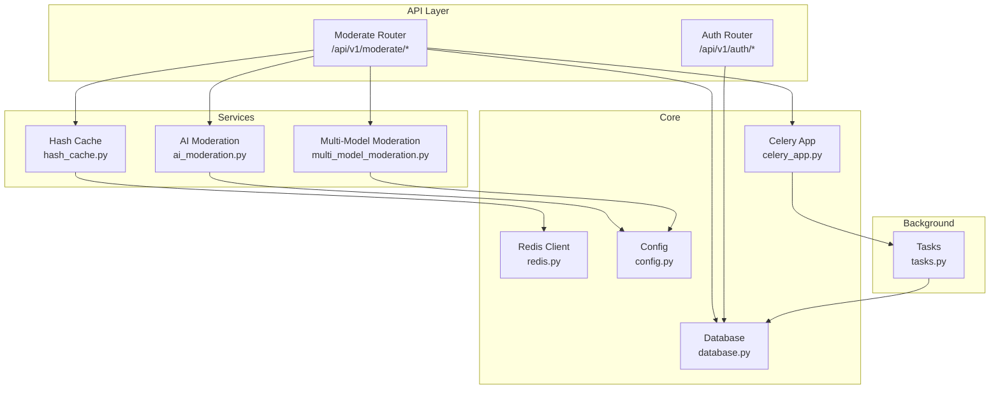
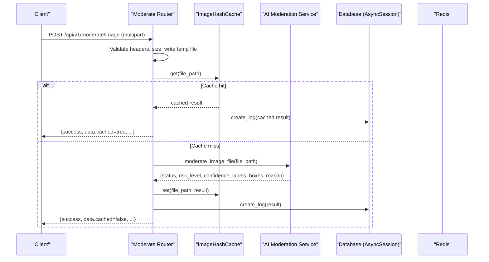
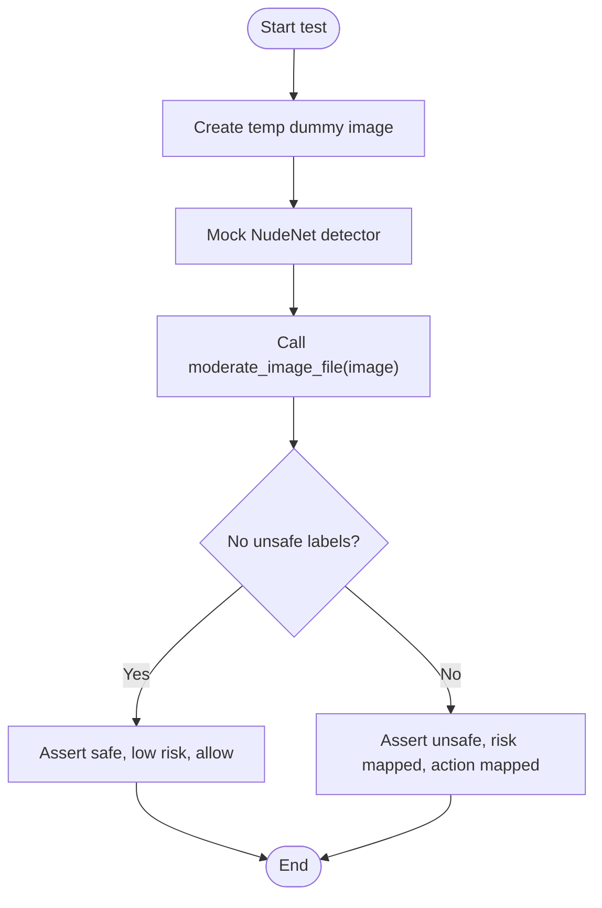
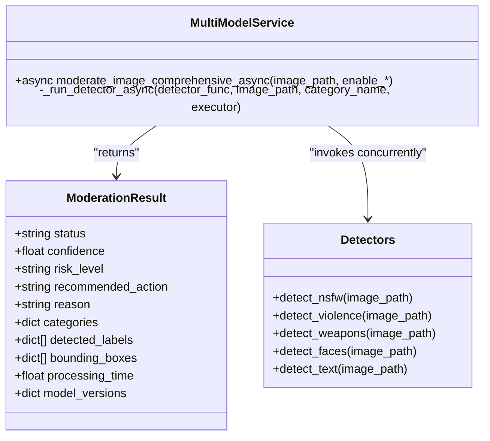
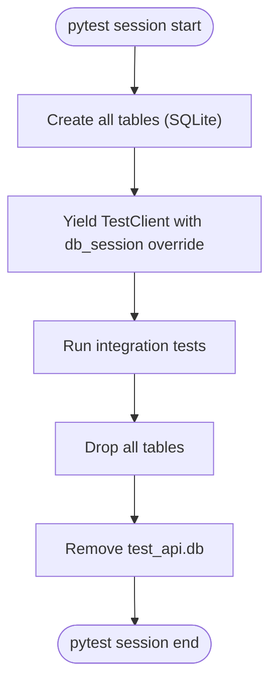
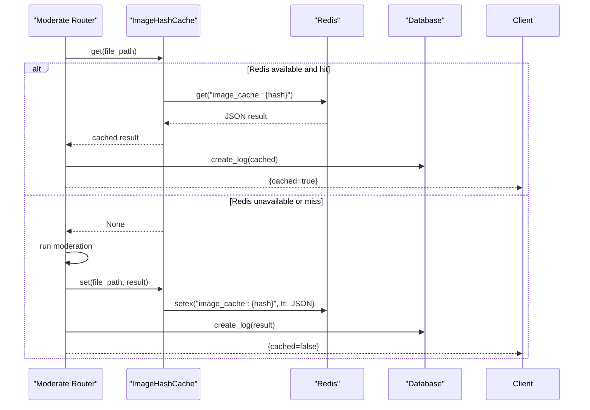
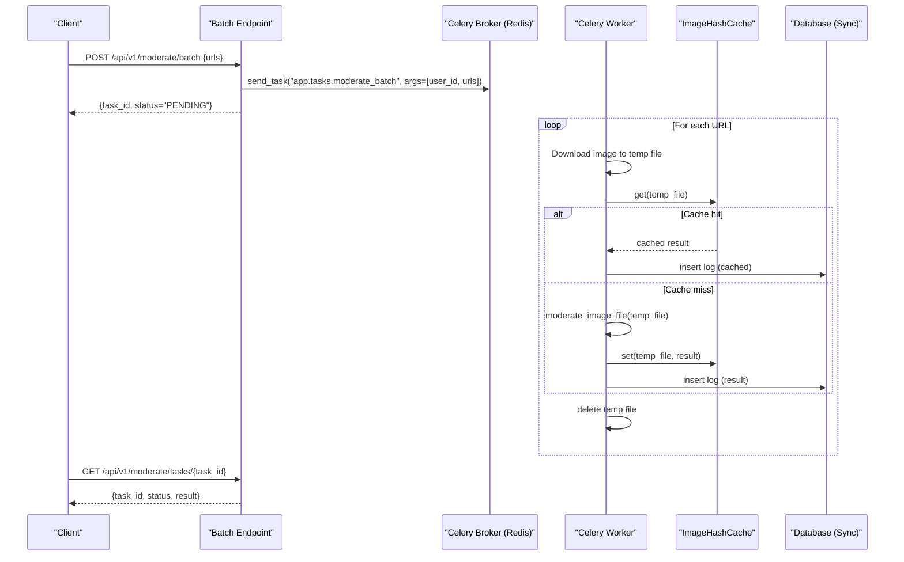
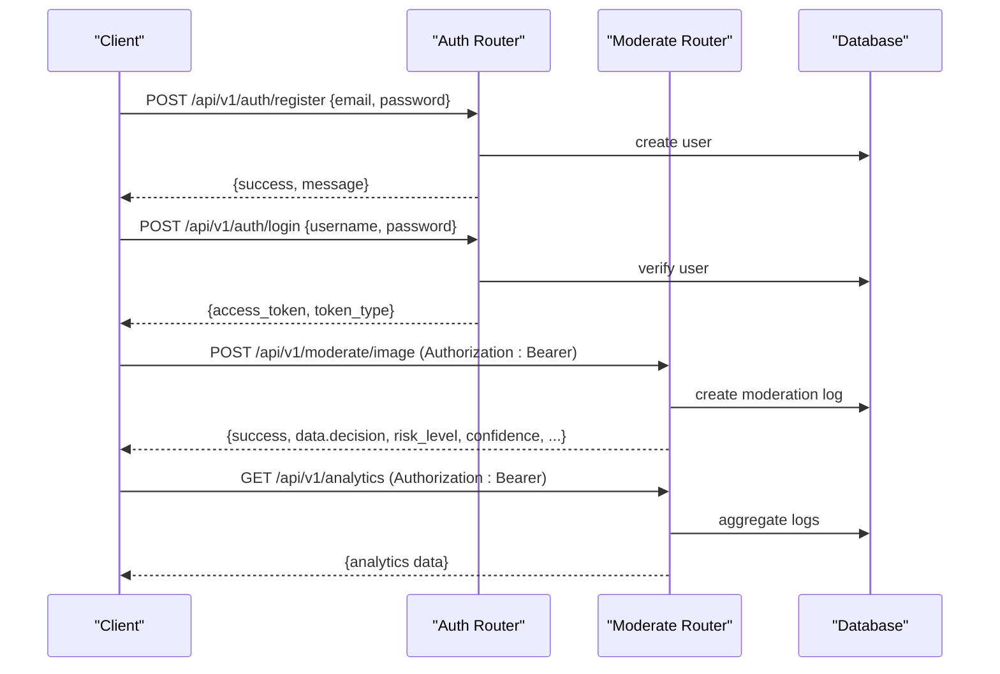
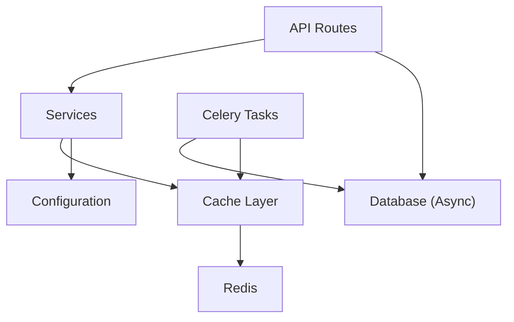

# Integration Testing

<cite>
**Referenced Files in This Document**
- [conftest.py](file://backend/tests/conftest.py)
- [test_auth_routes.py](file://backend/tests/test_auth_routes.py)
- [test_moderation_engine.py](file://backend/tests/test_moderation_engine.py)
- [moderate.py](file://backend/app/api/moderate.py)
- [ai_moderation.py](file://backend/app/services/ai_moderation.py)
- [multi_model_moderation.py](file://backend/app/services/multi_model_moderation.py)
- [hash_cache.py](file://backend/app/services/hash_cache.py)
- [redis.py](file://backend/app/core/redis.py)
- [celery_app.py](file://backend/app/core/celery_app.py)
- [tasks.py](file://backend/app/tasks.py)
- [database.py](file://backend/app/core/database.py)
- [auth.py](file://backend/app/api/auth.py)
- [user.py](file://backend/app/models/user.py)
- [config.py](file://backend/app/core/config.py)
- [docker-compose.yml](file://docker-compose.yml)
</cite>

## Table of Contents
1. Introduction
2. Project Structure
3. Core Components
4. Architecture Overview
5. Detailed Component Analysis
6. Dependency Analysis
7. Performance Considerations
8. Troubleshooting Guide
9. Conclusion

## Introduction
This document provides comprehensive integration testing guidance for the OmniShield platform, focusing on end-to-end workflows and system-level validation. It covers:
- Moderation engine tests: safe image processing, unsafe detection, fallback rules when models fail, and multi-model ensemble voting with confidence calibration.
- Integration test setup: database interactions using isolated test databases, Redis caching layer validation, Celery task queue testing, and external service mocking.
- End-to-end user workflows: registration → login → API key creation → content upload → moderation results → analytics retrieval.
- Concurrency, error propagation across service boundaries, and data consistency across components.
- Background job processing, cache invalidation scenarios, and distributed behaviors.
- Test fixtures for complex data setups, transaction management during tests, and assertion strategies for multi-component interactions.

## Project Structure
The backend is a FastAPI application with layered architecture:
- API routes (FastAPI routers) handle HTTP requests and orchestrate services.
- Services encapsulate business logic (AI moderation, hashing/cache).
- Repositories and models interact with the database.
- Background tasks are executed via Celery.
- Configuration centralizes environment-driven settings.
- Tests use pytest with an isolated SQLite database and dependency overrides to simulate production-like behavior.

**Diagram sources**
- [moderate.py:223-378](file://backend/app/api/moderate.py#L223-L378)
- [ai_moderation.py:148-275](file://backend/app/services/ai_moderation.py#L148-L275)
- [multi_model_moderation.py:532-732](file://backend/app/services/multi_model_moderation.py#L532-L732)
- [hash_cache.py:8-59](file://backend/app/services/hash_cache.py#L8-L59)
- [redis.py:1-21](file://backend/app/core/redis.py#L1-L21)
- [celery_app.py:1-21](file://backend/app/core/celery_app.py#L1-L21)
- [tasks.py:14-142](file://backend/app/tasks.py#L14-L142)
- [database.py:1-50](file://backend/app/core/database.py#L1-L50)
- [config.py:6-148](file://backend/app/core/config.py#L6-L148)

**Section sources**
- [moderate.py:223-378](file://backend/app/api/moderate.py#L223-L378)
- [ai_moderation.py:148-275](file://backend/app/services/ai_moderation.py#L148-L275)
- [multi_model_moderation.py:532-732](file://backend/app/services/multi_model_moderation.py#L532-L732)
- [hash_cache.py:8-59](file://backend/app/services/hash_cache.py#L8-L59)
- [redis.py:1-21](file://backend/app/core/redis.py#L1-L21)
- [celery_app.py:1-21](file://backend/app/core/celery_app.py#L1-L21)
- [tasks.py:14-142](file://backend/app/tasks.py#L14-L142)
- [database.py:1-50](file://backend/app/core/database.py#L1-L50)
- [config.py:6-148](file://backend/app/core/config.py#L6-L148)

## Core Components
- Moderation Engine: Single-model pipeline with NudeNet, close-up padding, fallback heuristics, and risk mapping.
- Multi-Model Ensemble: Parallel execution of NSFW, violence, weapons, faces, and text detectors; aggregation and confidence calibration.
- Hash Cache: SHA256-based deduplication with optional Redis-backed storage and TTL.
- Database Layer: Async SQLAlchemy sessions injected into endpoints; sync sessions used by background tasks.
- Celery Tasks: Batch URL moderation with download, cache check, inference, persistence, and cleanup.
- Authentication: Registration and login flows returning JWT tokens.

Key responsibilities and integration points:
- API routes validate inputs, manage uploads, call services, persist logs, and return structured responses.
- Services implement core logic and coordinate external dependencies (models, OCR, profanity filters).
- Cache layer abstracts Redis availability and gracefully degrades if unavailable.
- Background tasks ensure idempotent processing and consistent DB state.

**Section sources**
- [ai_moderation.py:148-275](file://backend/app/services/ai_moderation.py#L148-L275)
- [multi_model_moderation.py:532-732](file://backend/app/services/multi_model_moderation.py#L532-L732)
- [hash_cache.py:8-59](file://backend/app/services/hash_cache.py#L8-L59)
- [database.py:1-50](file://backend/app/core/database.py#L1-L50)
- [tasks.py:14-142](file://backend/app/tasks.py#L14-L142)
- [auth.py:15-90](file://backend/app/api/auth.py#L15-L90)

## Architecture Overview
End-to-end flow for single image moderation:
- Client uploads image to /api/v1/moderate/image.
- Route validates file type/size, writes temp file, checks hash cache.
- On cache miss, runs AI moderation service; persists log; caches result.
- Response includes decision, risk level, confidence, labels, bounding boxes, and action.

**Diagram sources**
- [moderate.py:223-378](file://backend/app/api/moderate.py#L223-L378)
- [ai_moderation.py:148-275](file://backend/app/services/ai_moderation.py#L148-L275)
- [hash_cache.py:8-59](file://backend/app/services/hash_cache.py#L8-L59)
- [redis.py:1-21](file://backend/app/core/redis.py#L1-L21)
- [database.py:35-42](file://backend/app/core/database.py#L35-L42)

## Detailed Component Analysis

### Moderation Engine Integration Tests
Focus areas:
- Safe image processing: no detections, low risk, allow action.
- Unsafe explicit detection: critical risk, block action, labels and bounding boxes present.
- Fallback rules: close-up belly without face triggers inferred label and quarantine/block depending on thresholds.

Test setup and assertions:
- Use temporary dummy images to avoid heavy model loading.
- Mock NudeNet detector and close-up helper to control outcomes deterministically.
- Assert status, risk_level, recommended_action, detected_labels, and bounding_boxes.

**Diagram sources**
- [test_moderation_engine.py:24-92](file://backend/tests/test_moderation_engine.py#L24-L92)
- [ai_moderation.py:76-118](file://backend/app/services/ai_moderation.py#L76-L118)
- [ai_moderation.py:148-275](file://backend/app/services/ai_moderation.py#L148-L275)

**Section sources**
- [test_moderation_engine.py:1-92](file://backend/tests/test_moderation_engine.py#L1-L92)
- [ai_moderation.py:148-275](file://backend/app/services/ai_moderation.py#L148-L275)

### Multi-Model Ensemble Voting and Confidence Calibration
Focus areas:
- Parallel execution of multiple detectors (NSFW, violence, weapons, faces, text).
- Aggregation strategy: highest confidence among unsafe categories determines overall confidence; risk score mapping to levels; recommended actions based on thresholds.
- Professional portrait override: one face, no weapons, low violence probability can override violence detection to safe.

Testing approach:
- Enable/disable specific detectors via query parameters.
- Verify aggregated fields: status, confidence, risk_level, recommended_action, categories, model_versions, face_count, detected_text, contains_profanity.
- Validate that errors/skipped categories do not break aggregation.

**Diagram sources**
- [multi_model_moderation.py:28-41](file://backend/app/services/multi_model_moderation.py#L28-L41)
- [multi_model_moderation.py:532-732](file://backend/app/services/multi_model_moderation.py#L532-L732)
- [multi_model_moderation.py:179-486](file://backend/app/services/multi_model_moderation.py#L179-L486)

**Section sources**
- [multi_model_moderation.py:532-732](file://backend/app/services/multi_model_moderation.py#L532-L732)
- [moderate.py:446-615](file://backend/app/api/moderate.py#L446-L615)

### Database Interaction Tests with Isolated Test Database
Setup:
- Session-scoped fixture creates and drops tables using an isolated SQLite file.
- Per-test async session fixture provides a transactional scope with rollback semantics.
- Dependency override injects the test session into FastAPI’s get_db.

Integration patterns:
- Use TestClient to exercise endpoints against the overridden DB.
- Ensure cleanup of test DB file after session teardown.

**Diagram sources**
- [conftest.py:26-51](file://backend/tests/conftest.py#L26-L51)
- [conftest.py:53-72](file://backend/tests/conftest.py#L53-L72)
- [database.py:19-29](file://backend/app/core/database.py#L19-L29)

**Section sources**
- [conftest.py:1-72](file://backend/tests/conftest.py#L1-L72)
- [database.py:1-50](file://backend/app/core/database.py#L1-L50)

### Redis Caching Layer Validation
Validation goals:
- Confirm cache hits reduce inference calls and DB writes.
- Ensure graceful degradation when Redis is unavailable.
- Validate TTL behavior and key structure.

Approach:
- Mock redis_client or disable connection to simulate failure.
- Assert response includes cached flag and correct metadata.
- Verify keys follow pattern image_cache:{sha256}.

**Diagram sources**
- [hash_cache.py:21-59](file://backend/app/services/hash_cache.py#L21-L59)
- [redis.py:1-21](file://backend/app/core/redis.py#L1-L21)
- [moderate.py:283-344](file://backend/app/api/moderate.py#L283-L344)

**Section sources**
- [hash_cache.py:8-59](file://backend/app/services/hash_cache.py#L8-L59)
- [redis.py:1-21](file://backend/app/core/redis.py#L1-L21)
- [moderate.py:283-344](file://backend/app/api/moderate.py#L283-L344)

### Celery Task Queue Testing
Focus areas:
- Queuing batch moderation jobs from API.
- Worker processing: download images, cache checks, inference, DB persistence, cleanup.
- Status polling via task ID.

Testing approach:
- Use in-memory broker/backend or mock Redis for local tests.
- Send tasks via celery_app.send_task and poll AsyncResult.
- Assert final results include success/failure per URL and DB entries.

**Diagram sources**
- [moderate.py:380-443](file://backend/app/api/moderate.py#L380-L443)
- [tasks.py:14-142](file://backend/app/tasks.py#L14-L142)
- [celery_app.py:1-21](file://backend/app/core/celery_app.py#L1-L21)
- [hash_cache.py:8-59](file://backend/app/services/hash_cache.py#L8-L59)

**Section sources**
- [moderate.py:380-443](file://backend/app/api/moderate.py#L380-L443)
- [tasks.py:14-142](file://backend/app/tasks.py#L14-L142)
- [celery_app.py:1-21](file://backend/app/core/celery_app.py#L1-L21)

### External Service Mocking Strategy
Recommended mocks:
- NudeNet detector: patch get_detector to return controlled detections.
- Close-up heuristic: patch is_closeup to force fallback paths.
- Redis client: replace redis_client with MagicMock or disable connection to test graceful degradation.
- Celery broker/backend: configure in-memory broker or mock send_task and AsyncResult.

Benefits:
- Deterministic outcomes for safe/unsafe/fallback scenarios.
- Isolation from slow ML model loads and external network calls.
- Faster CI runs and reliable assertions.

**Section sources**
- [test_moderation_engine.py:24-92](file://backend/tests/test_moderation_engine.py#L24-L92)
- [redis.py:1-21](file://backend/app/core/redis.py#L1-L21)
- [celery_app.py:1-21](file://backend/app/core/celery_app.py#L1-L21)

### End-to-End User Workflow Tests
Workflow:
- Register user → Login to obtain JWT → Create API key (if applicable) → Upload image → Retrieve moderation results → Query analytics.

Implementation notes:
- Use TestClient to post registration payload and assert created user fields.
- Post login credentials and assert token_type and access_token presence.
- Subsequent requests should include Authorization header with bearer token.
- Upload image via multipart/form-data and assert moderation response fields.
- Analytics endpoint should reflect persisted logs and computed metrics.

**Diagram sources**
- [auth.py:15-90](file://backend/app/api/auth.py#L15-L90)
- [moderate.py:223-378](file://backend/app/api/moderate.py#L223-L378)
- [user.py:10-28](file://backend/app/models/user.py#L10-L28)

**Section sources**
- [test_auth_routes.py:1-46](file://backend/tests/test_auth_routes.py#L1-L46)
- [auth.py:15-90](file://backend/app/api/auth.py#L15-L90)
- [moderate.py:223-378](file://backend/app/api/moderate.py#L223-L378)
- [user.py:10-28](file://backend/app/models/user.py#L10-L28)

### Concurrent Request Handling and Error Propagation
Concurrency:
- Multi-model moderation uses asyncio.gather with ThreadPoolExecutor to parallelize CPU/GPU-bound inference.
- API endpoints process uploads asynchronously and return promptly for queued jobs.

Error propagation:
- Services catch exceptions and return structured error responses (status=error, reason details).
- Routes convert service errors to HTTP 500 with descriptive messages.
- Background tasks log failures per URL and continue processing remaining items.

Testing strategies:
- Simultaneous uploads to stress test concurrency and resource contention.
- Inject model errors to verify graceful degradation and consistent DB state.
- Assert that partial failures in batch jobs do not abort entire batches.

**Section sources**
- [multi_model_moderation.py:532-732](file://backend/app/services/multi_model_moderation.py#L532-L732)
- [moderate.py:380-443](file://backend/app/api/moderate.py#L380-L443)
- [tasks.py:124-142](file://backend/app/tasks.py#L124-L142)

### Data Consistency Across Multiple Components
Consistency guarantees:
- Cache writes occur only after successful inference and before DB persistence.
- Logs include decision, risk_level, confidence, labels, boxes, and timestamps.
- Background tasks perform idempotent operations: cache-first, then DB commit.

Verification:
- Compare cached vs DB-persisted values for identical inputs.
- Ensure no duplicate logs for same image hash within a session.
- Validate that skipped/error categories do not corrupt aggregated results.

**Section sources**
- [moderate.py:283-344](file://backend/app/api/moderate.py#L283-L344)
- [tasks.py:44-110](file://backend/app/tasks.py#L44-L110)
- [multi_model_moderation.py:654-732](file://backend/app/services/multi_model_moderation.py#L654-L732)

### Background Job Processing and Cache Invalidation Scenarios
Background jobs:
- Video moderation queues jobs and returns status URLs for polling.
- Batch moderation downloads images, processes them, and updates DB.

Cache invalidation:
- TTL-based expiration ensures stale results are refreshed.
- Consider implementing explicit invalidation on policy changes or model updates.

Testing approaches:
- Poll video status endpoint until completion and assert aggregated fields.
- Force cache TTL expiry and re-run moderation to confirm cache miss path.
- Validate that policy/model version changes trigger appropriate invalidation.

**Section sources**
- [moderate.py:85-221](file://backend/app/api/moderate.py#L85-L221)
- [hash_cache.py:37-59](file://backend/app/services/hash_cache.py#L37-L59)

### Distributed System Behaviors
Distributed aspects:
- Redis-backed cache shared across instances.
- Celery workers consume tasks from broker and write to DB.
- Graceful degradation when Redis is down.

Testing approaches:
- Spin up docker-compose services for PostgreSQL and Redis to mirror production topology.
- Run tests against real services to validate cross-process interactions.
- Simulate Redis unavailability and assert fallback behavior.

**Section sources**
- [docker-compose.yml:1-108](file://docker-compose.yml#L1-L108)
- [redis.py:1-21](file://backend/app/core/redis.py#L1-L21)
- [celery_app.py:1-21](file://backend/app/core/celery_app.py#L1-L21)

## Dependency Analysis
Component coupling and cohesion:
- API routes depend on services and repositories; services depend on configuration and external libraries.
- Cache layer depends on Redis client; it abstracts availability and errors.
- Background tasks depend on sync DB sessions and cache layer.

Potential circular dependencies:
- Avoid importing services inside route modules at module load time; lazy imports are used where necessary.

External dependencies:
- Redis for caching and Celery broker/backend.
- PostgreSQL for persistent storage.
- ML libraries (NudeNet, CLIP, YOLOv8, MTCNN, PaddleOCR) loaded lazily.

**Diagram sources**
- [moderate.py:223-615](file://backend/app/api/moderate.py#L223-L615)
- [hash_cache.py:8-59](file://backend/app/services/hash_cache.py#L8-L59)
- [redis.py:1-21](file://backend/app/core/redis.py#L1-L21)
- [database.py:1-50](file://backend/app/core/database.py#L1-L50)
- [tasks.py:14-142](file://backend/app/tasks.py#L14-L142)
- [config.py:6-148](file://backend/app/core/config.py#L6-L148)

**Section sources**
- [moderate.py:223-615](file://backend/app/api/moderate.py#L223-L615)
- [hash_cache.py:8-59](file://backend/app/services/hash_cache.py#L8-L59)
- [redis.py:1-21](file://backend/app/core/redis.py#L1-L21)
- [database.py:1-50](file://backend/app/core/database.py#L1-L50)
- [tasks.py:14-142](file://backend/app/tasks.py#L14-L142)
- [config.py:6-148](file://backend/app/core/config.py#L6-L148)

## Performance Considerations
- Prefer cache hits to reduce inference latency and DB writes.
- Tune max_workers for multi-model moderation based on CPU/GPU resources.
- Use async endpoints for non-blocking request handling.
- Monitor processing_time fields to identify bottlenecks.
- Consider GPU acceleration for heavy models where available.

[No sources needed since this section provides general guidance]

## Troubleshooting Guide
Common issues and resolutions:
- Redis connection failures: verify REDIS_URL and service health; expect graceful degradation.
- Model loading errors: ensure required libraries are installed; lazy loaders log warnings and disable features.
- File validation failures: confirm magic bytes match allowed types; adjust ALLOWED_EXTENSIONS if needed.
- Batch job failures: inspect worker logs for download/inference errors; ensure temp files are cleaned up.

**Section sources**
- [redis.py:1-21](file://backend/app/core/redis.py#L1-L21)
- [moderate.py:32-61](file://backend/app/api/moderate.py#L32-L61)
- [tasks.py:124-142](file://backend/app/tasks.py#L124-L142)

## Conclusion
This integration testing guide outlines robust strategies to validate OmniShield’s moderation engine, caching, background processing, and end-to-end workflows. By leveraging isolated test databases, dependency overrides, and targeted mocks, teams can achieve deterministic, fast, and comprehensive coverage across single-model and multi-model pipelines, ensuring reliability and correctness under concurrent and distributed conditions.

[No sources needed since this section summarizes without analyzing specific files]