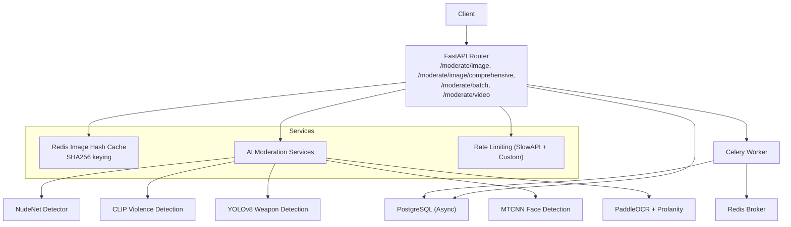
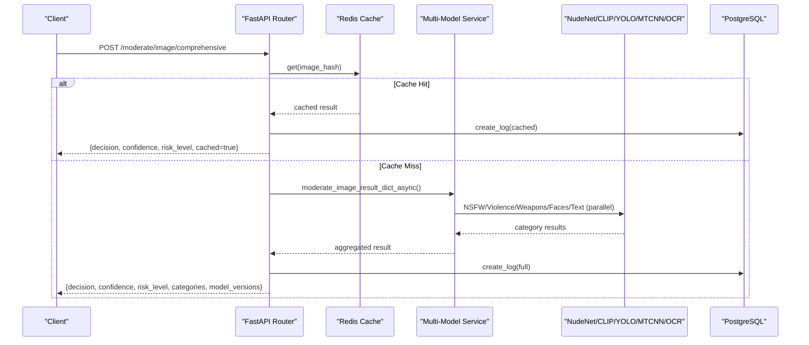
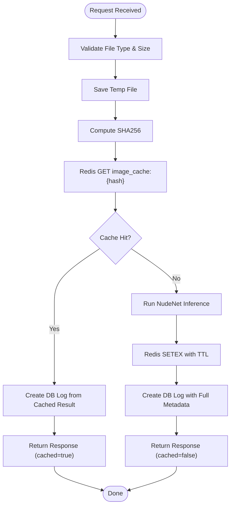
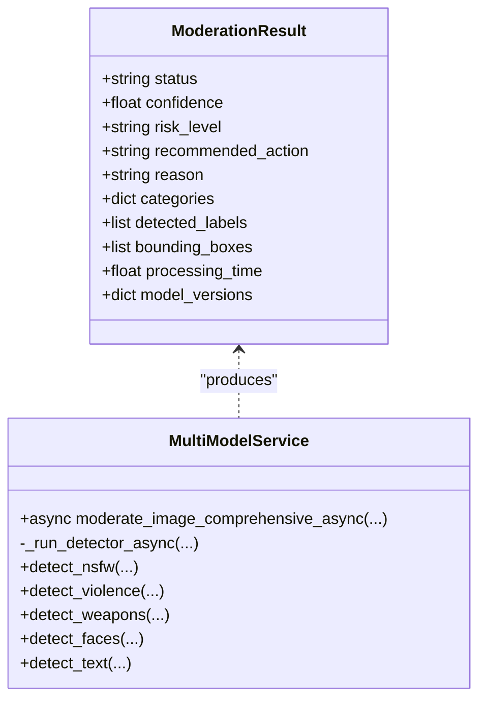
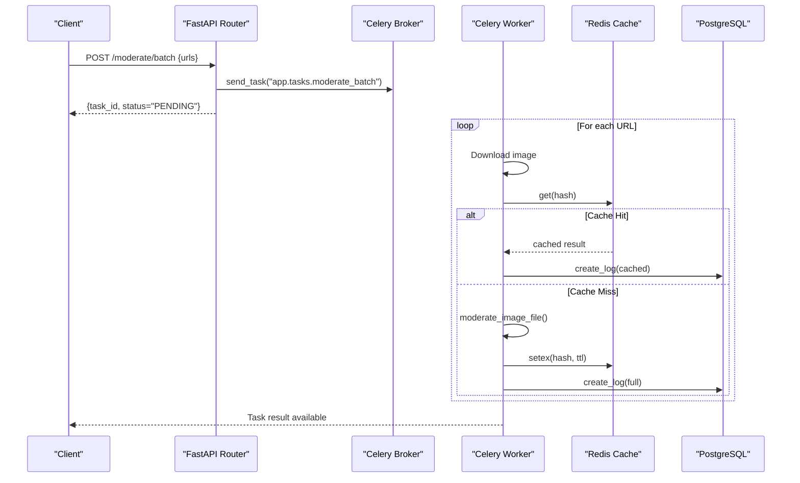
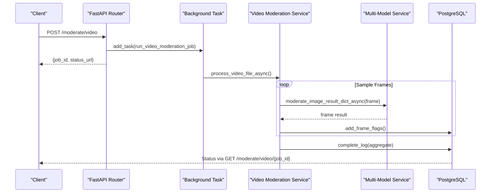
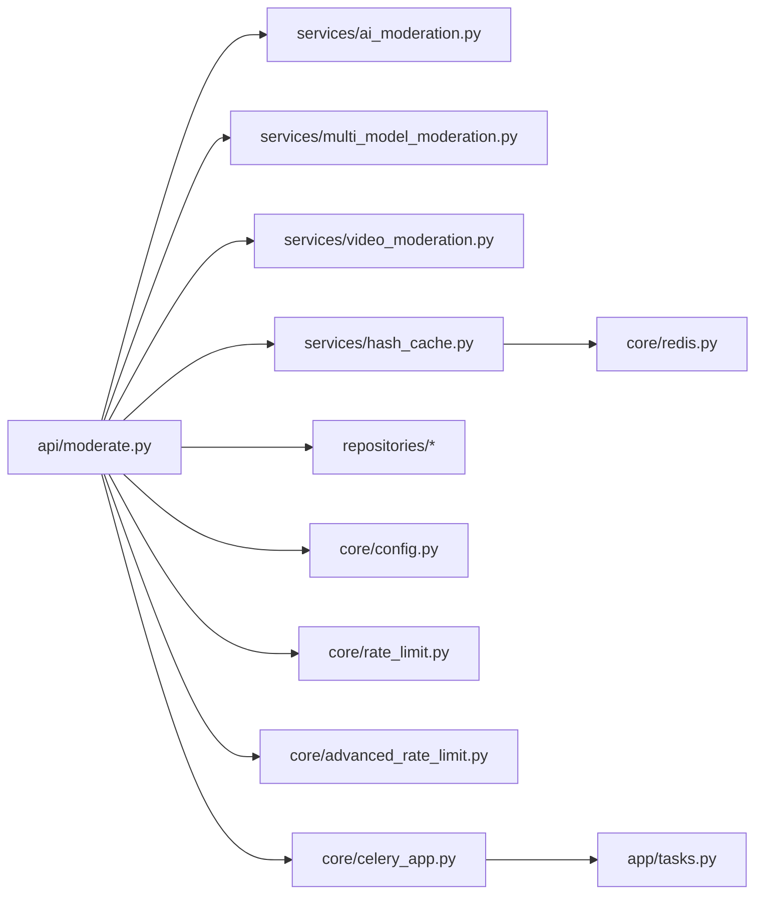

# Performance Testing

<cite>
**Referenced Files in This Document**
- [moderate.py](file://backend/app/api/moderate.py)
- [ai_moderation.py](file://backend/app/services/ai_moderation.py)
- [multi_model_moderation.py](file://backend/app/services/multi_model_moderation.py)
- [hash_cache.py](file://backend/app/services/hash_cache.py)
- [redis.py](file://backend/app/core/redis.py)
- [celery_app.py](file://backend/app/core/celery_app.py)
- [tasks.py](file://backend/app/tasks.py)
- [video_moderation.py](file://backend/app/services/video_moderation.py)
- [config.py](file://backend/app/core/config.py)
- [rate_limit.py](file://backend/app/core/rate_limit.py)
- [advanced_rate_limit.py](file://backend/app/core/advanced_rate_limit.py)
- [docker-compose.yml](file://docker-compose.yml)
- [ci.yml](file://.github/workflows/ci.yml)
- [speed_test.py](file://backend/speed_test.py)
</cite>

## Table of Contents
1. Introduction
2. Project Structure
3. Core Components
4. Architecture Overview
5. Detailed Component Analysis
6. Dependency Analysis
7. Performance Considerations
8. Troubleshooting Guide
9. Conclusion
10. Appendices

## Introduction
This document defines a comprehensive performance testing strategy for the OmniShield platform, focusing on benchmarking, load testing, and optimization validation. It covers:
- Cache hit ratio measurement using SHA256 image hashing
- Model inference time measurements across NudeNet, CLIP, YOLOv8, MTCNN, and PaddleOCR
- Concurrent request handling capacity and throughput
- Load testing with Locust or k6 to simulate real-world usage patterns and measure response time percentiles (P50, P95, P99)
- Memory profiling for AI model loading, GPU utilization monitoring, and CPU-bound operation optimization
- Benchmarking database query performance, Redis cache effectiveness, and Celery worker throughput
- Stress testing scenarios including large batch uploads, concurrent video processing, and high-volume moderation requests
- Performance regression detection, continuous performance monitoring, and automated performance gates in CI/CD pipelines
- Debugging techniques for performance issues, profiling tools integration, and optimization recommendations based on test results

## Project Structure
The backend exposes FastAPI endpoints for single image moderation, comprehensive multi-model moderation, batch moderation via Celery, and asynchronous video moderation. Caching is implemented with Redis using SHA256 file hashes. Multi-model moderation runs concurrently using asyncio and ThreadPoolExecutor. Video moderation samples frames and processes them asynchronously.

**Diagram sources**
- [moderate.py:223-378](file://backend/app/api/moderate.py#L223-L378)
- [moderate.py:446-615](file://backend/app/api/moderate.py#L446-L615)
- [moderate.py:380-444](file://backend/app/api/moderate.py#L380-L444)
- [moderate.py:85-189](file://backend/app/api/moderate.py#L85-L189)
- [hash_cache.py:8-59](file://backend/app/services/hash_cache.py#L8-L59)
- [redis.py:1-21](file://backend/app/core/redis.py#L1-L21)
- [ai_moderation.py:148-275](file://backend/app/services/ai_moderation.py#L148-L275)
- [multi_model_moderation.py:532-732](file://backend/app/services/multi_model_moderation.py#L532-L732)
- [celery_app.py:1-21](file://backend/app/core/celery_app.py#L1-L21)
- [tasks.py:14-142](file://backend/app/tasks.py#L14-L142)
- [video_moderation.py:89-254](file://backend/app/services/video_moderation.py#L89-L254)
- [rate_limit.py:1-44](file://backend/app/core/rate_limit.py#L1-L44)
- [advanced_rate_limit.py:1-113](file://backend/app/core/advanced_rate_limit.py#L1-L113)

**Section sources**
- [moderate.py:223-378](file://backend/app/api/moderate.py#L223-L378)
- [moderate.py:446-615](file://backend/app/api/moderate.py#L446-L615)
- [moderate.py:380-444](file://backend/app/api/moderate.py#L380-L444)
- [moderate.py:85-189](file://backend/app/api/moderate.py#L85-L189)
- [hash_cache.py:8-59](file://backend/app/services/hash_cache.py#L8-L59)
- [redis.py:1-21](file://backend/app/core/redis.py#L1-L21)
- [ai_moderation.py:148-275](file://backend/app/services/ai_moderation.py#L148-L275)
- [multi_model_moderation.py:532-732](file://backend/app/services/multi_model_moderation.py#L532-L732)
- [celery_app.py:1-21](file://backend/app/core/celery_app.py#L1-L21)
- [tasks.py:14-142](file://backend/app/tasks.py#L14-L142)
- [video_moderation.py:89-254](file://backend/app/services/video_moderation.py#L89-L254)
- [rate_limit.py:1-44](file://backend/app/core/rate_limit.py#L1-L44)
- [advanced_rate_limit.py:1-113](file://backend/app/core/advanced_rate_limit.py#L1-L113)

## Core Components
- Image moderation endpoint: validates uploads, checks Redis cache by SHA256 hash, runs NudeNet on cache miss, persists logs, returns decision metadata.
- Comprehensive moderation endpoint: orchestrates parallel multi-model inference (NudeNet, CLIP, YOLOv8, MTCNN, PaddleOCR), aggregates results, records detailed categories and model versions.
- Batch moderation: queues URLs for background processing via Celery; workers download images, check cache, run NudeNet, persist results.
- Video moderation: samples frames at configurable intervals, runs comprehensive moderation per frame concurrently, aggregates flags and risk levels.
- Caching layer: Redis-backed cache keyed by SHA256 file hash with TTL; graceful degradation if Redis unavailable.
- Rate limiting: SlowAPI-based IP/user/key-based limits plus custom windowed counting in Redis.
- Configuration: environment-driven settings for thresholds, GPU toggles, rate limits, and service URLs.

Key performance-relevant behaviors:
- Lazy initialization of heavy models to reduce startup latency.
- Parallel execution of multiple detectors using asyncio.gather and ThreadPoolExecutor.
- Short-lived temporary files for uploads and frames, cleaned up after processing.
- Processing time recorded per request and per frame.

**Section sources**
- [moderate.py:223-378](file://backend/app/api/moderate.py#L223-L378)
- [moderate.py:446-615](file://backend/app/api/moderate.py#L446-L615)
- [moderate.py:380-444](file://backend/app/api/moderate.py#L380-L444)
- [moderate.py:85-189](file://backend/app/api/moderate.py#L85-L189)
- [hash_cache.py:8-59](file://backend/app/services/hash_cache.py#L8-L59)
- [ai_moderation.py:148-275](file://backend/app/services/ai_moderation.py#L148-L275)
- [multi_model_moderation.py:532-732](file://backend/app/services/multi_model_moderation.py#L532-L732)
- [tasks.py:14-142](file://backend/app/tasks.py#L14-L142)
- [video_moderation.py:89-254](file://backend/app/services/video_moderation.py#L89-L254)
- [redis.py:1-21](file://backend/app/core/redis.py#L1-L21)
- [advanced_rate_limit.py:1-113](file://backend/app/core/advanced_rate_limit.py#L1-L113)
- [config.py:6-148](file://backend/app/core/config.py#L6-L148)

## Architecture Overview
Performance-critical flows include:
- Single image moderation: upload -> validate -> SHA256 -> Redis cache lookup -> NudeNet inference (cache miss) -> DB log -> response.
- Comprehensive moderation: upload -> validate -> multi-model async pipeline -> aggregation -> DB log -> response.
- Batch moderation: queue task -> worker downloads -> cache check -> NudeNet -> DB log -> result aggregation.
- Video moderation: queue job -> sample frames -> concurrent moderation per frame -> aggregate flags -> DB update.

**Diagram sources**
- [moderate.py:446-615](file://backend/app/api/moderate.py#L446-L615)
- [hash_cache.py:21-59](file://backend/app/services/hash_cache.py#L21-L59)
- [multi_model_moderation.py:532-732](file://backend/app/services/multi_model_moderation.py#L532-L732)

## Detailed Component Analysis

### Image Moderation Flow and Cache Strategy
- Upload validation ensures safe formats and size constraints.
- SHA256 hashing used to deduplicate identical images; cache keys prefixed with namespace.
- On cache hit, DB log is created from cached metadata; on miss, NudeNet inference runs and results are cached with TTL.
- Processing time is measured and returned.

**Diagram sources**
- [moderate.py:223-378](file://backend/app/api/moderate.py#L223-L378)
- [hash_cache.py:13-59](file://backend/app/services/hash_cache.py#L13-L59)
- [ai_moderation.py:148-275](file://backend/app/services/ai_moderation.py#L148-L275)

**Section sources**
- [moderate.py:223-378](file://backend/app/api/moderate.py#L223-L378)
- [hash_cache.py:13-59](file://backend/app/services/hash_cache.py#L13-L59)
- [ai_moderation.py:148-275](file://backend/app/services/ai_moderation.py#L148-L275)

### Comprehensive Multi-Model Moderation
- Orchestrates NSFW (NudeNet), Violence (CLIP), Weapons (YOLOv8), Faces (MTCNN), Text (PaddleOCR + Profanity).
- Uses asyncio.gather with ThreadPoolExecutor to run detectors concurrently.
- Aggregates labels, bounding boxes, risk levels, and model versions; applies professional portrait override logic for violence false positives.
- Returns structured result with categories and processing time.

**Diagram sources**
- [multi_model_moderation.py:28-41](file://backend/app/services/multi_model_moderation.py#L28-L41)
- [multi_model_moderation.py:532-732](file://backend/app/services/multi_model_moderation.py#L532-L732)
- [multi_model_moderation.py:179-486](file://backend/app/services/multi_model_moderation.py#L179-L486)

**Section sources**
- [multi_model_moderation.py:532-732](file://backend/app/services/multi_model_moderation.py#L532-L732)
- [multi_model_moderation.py:179-486](file://backend/app/services/multi_model_moderation.py#L179-L486)

### Batch Moderation via Celery
- Endpoint sends task to Celery broker; client polls task status.
- Worker downloads images, checks cache, runs NudeNet, persists logs, cleans temp files.
- Suitable for stress testing high-volume URL moderation.

**Diagram sources**
- [moderate.py:380-444](file://backend/app/api/moderate.py#L380-L444)
- [tasks.py:14-142](file://backend/app/tasks.py#L14-L142)
- [hash_cache.py:21-59](file://backend/app/services/hash_cache.py#L21-L59)
- [ai_moderation.py:148-275](file://backend/app/services/ai_moderation.py#L148-L275)

**Section sources**
- [moderate.py:380-444](file://backend/app/api/moderate.py#L380-L444)
- [tasks.py:14-142](file://backend/app/tasks.py#L14-L142)

### Video Moderation Pipeline
- Accepts video upload, creates pending job, samples frames at configured interval, converts BGR to RGB, writes frames to temp directory.
- Runs comprehensive moderation per frame concurrently, aggregates flags and risk levels, updates job status.

**Diagram sources**
- [moderate.py:85-189](file://backend/app/api/moderate.py#L85-L189)
- [video_moderation.py:89-254](file://backend/app/services/video_moderation.py#L89-L254)
- [multi_model_moderation.py:532-732](file://backend/app/services/multi_model_moderation.py#L532-L732)

**Section sources**
- [moderate.py:85-189](file://backend/app/api/moderate.py#L85-L189)
- [video_moderation.py:89-254](file://backend/app/services/video_moderation.py#L89-L254)

## Dependency Analysis
- API depends on services for moderation and caching, repositories for persistence, and configuration for runtime behavior.
- Multi-model service depends on external ML libraries (torch, transformers, ultralytics, facenet_pytorch, paddleocr).
- Redis connection pool initialized once; graceful degradation when unavailable.
- Celery app configured with broker and backend pointing to Redis.

**Diagram sources**
- [moderate.py:1-22](file://backend/app/api/moderate.py#L1-L22)
- [ai_moderation.py:1-23](file://backend/app/services/ai_moderation.py#L1-L23)
- [multi_model_moderation.py:1-26](file://backend/app/services/multi_model_moderation.py#L1-L26)
- [video_moderation.py:1-24](file://backend/app/services/video_moderation.py#L1-L24)
- [hash_cache.py:1-12](file://backend/app/services/hash_cache.py#L1-L12)
- [redis.py:1-21](file://backend/app/core/redis.py#L1-L21)
- [celery_app.py:1-21](file://backend/app/core/celery_app.py#L1-L21)
- [tasks.py:1-13](file://backend/app/tasks.py#L1-L13)
- [config.py:1-12](file://backend/app/core/config.py#L1-L12)
- [rate_limit.py:1-11](file://backend/app/core/rate_limit.py#L1-L11)
- [advanced_rate_limit.py:1-22](file://backend/app/core/advanced_rate_limit.py#L1-L22)

**Section sources**
- [moderate.py:1-22](file://backend/app/api/moderate.py#L1-L22)
- [ai_moderation.py:1-23](file://backend/app/services/ai_moderation.py#L1-L23)
- [multi_model_moderation.py:1-26](file://backend/app/services/multi_model_moderation.py#L1-L26)
- [video_moderation.py:1-24](file://backend/app/services/video_moderation.py#L1-L24)
- [hash_cache.py:1-12](file://backend/app/services/hash_cache.py#L1-L12)
- [redis.py:1-21](file://backend/app/core/redis.py#L1-L21)
- [celery_app.py:1-21](file://backend/app/core/celery_app.py#L1-L21)
- [tasks.py:1-13](file://backend/app/tasks.py#L1-L13)
- [config.py:1-12](file://backend/app/core/config.py#L1-L12)
- [rate_limit.py:1-11](file://backend/app/core/rate_limit.py#L1-L11)
- [advanced_rate_limit.py:1-22](file://backend/app/core/advanced_rate_limit.py#L1-L22)

## Performance Considerations
- Cache hit ratios: Measure proportion of requests served from Redis vs full inference. Use cache key structure and TTL to optimize reuse.
- Model inference times: Record per-model durations; leverage lazy loading and GPU acceleration where available.
- Concurrency: Tune ThreadPoolExecutor max_workers for multi-model moderation; balance CPU/GPU saturation.
- I/O overhead: Minimize disk writes; use temporary directories and ensure cleanup.
- Database write volume: Batch logging where possible; consider async writes for non-critical metrics.
- Rate limiting: Ensure Redis-backed rate limiting does not become a bottleneck; monitor pipeline latency.
- Video processing: Adjust frame sampling interval to control throughput vs accuracy trade-offs.

[No sources needed since this section provides general guidance]

## Troubleshooting Guide
- Redis connectivity failures: Graceful degradation activates; verify REDIS_URL and network health.
- Model loading errors: Check CUDA availability and library installation; review warnings for disabled detectors.
- High latency spikes: Inspect processing_time fields; identify slow detectors and adjust concurrency or thresholds.
- Disk space exhaustion: Monitor temporary file cleanup; ensure temp directories are pruned.
- Celery worker backlogs: Monitor broker queue length; scale workers and tune broker/backend settings.

**Section sources**
- [redis.py:1-21](file://backend/app/core/redis.py#L1-L21)
- [multi_model_moderation.py:65-147](file://backend/app/services/multi_model_moderation.py#L65-L147)
- [moderate.py:223-378](file://backend/app/api/moderate.py#L223-L378)
- [tasks.py:14-142](file://backend/app/tasks.py#L14-L142)

## Conclusion
This performance testing plan targets critical paths in OmniShield: image moderation with caching, comprehensive multi-model inference, batch processing, and video analysis. By combining targeted benchmarks, realistic load tests, and continuous monitoring, teams can detect regressions early, optimize resource usage, and maintain stable SLAs under varying workloads.

[No sources needed since this section summarizes without analyzing specific files]

## Appendices

### A. Benchmarking Strategies
- Baseline single-image moderation:
  - Warm-up: pre-load models once.
  - Metrics: total processing_time, per-model breakdown, cache hit ratio.
  - Tools: simple script similar to existing speed test.
- Multi-model moderation:
  - Vary enable flags to isolate model costs.
  - Measure aggregate confidence and risk mapping stability.
- Batch moderation:
  - Scale number of URLs; track worker throughput and error rates.
- Video moderation:
  - Vary frame_interval_seconds; measure frames sampled, flagged, and overall processing_time.

**Section sources**
- [speed_test.py:1-41](file://backend/speed_test.py#L1-L41)
- [multi_model_moderation.py:532-732](file://backend/app/services/multi_model_moderation.py#L532-L732)
- [tasks.py:14-142](file://backend/app/tasks.py#L14-L142)
- [video_moderation.py:89-254](file://backend/app/services/video_moderation.py#L89-L254)

### B. Load Testing with Locust/k6
- Scenarios:
  - Single image moderation: mix of unique and repeated images to exercise cache.
  - Comprehensive moderation: toggle features to simulate different client profiles.
  - Batch moderation: burst submissions with polling for completion.
  - Video moderation: submit multiple videos with varied durations and intervals.
- Metrics:
  - Response time percentiles (P50, P95, P99).
  - Throughput (requests/sec).
  - Error rates (4xx/5xx).
  - Resource utilization (CPU, memory, GPU).
- Data generation:
  - Create datasets of safe/unsafe images and short videos.
  - Precompute SHA256 sets to control cache hit ratios.

[No sources needed since this section provides general guidance]

### C. Memory Profiling and GPU Monitoring
- Python memory profiling:
  - Use tracemalloc or memory_profiler around model loading and inference.
  - Track peak memory during multi-model moderation.
- GPU utilization:
  - Monitor nvidia-smi or framework-specific metrics.
  - Ensure models move to GPU when available; verify device selection.
- CPU-bound optimizations:
  - Reduce unnecessary copies; reuse buffers where feasible.
  - Tune ThreadPoolExecutor workers based on core count.

**Section sources**
- [multi_model_moderation.py:103-117](file://backend/app/services/multi_model_moderation.py#L103-L117)
- [multi_model_moderation.py:65-82](file://backend/app/services/multi_model_moderation.py#L65-L82)

### D. Database Query Performance
- Indexing:
  - Ensure indexes on frequently queried fields (user_id, image_hash, created_at).
- Connection pooling:
  - Verify async engine pool sizes match expected concurrency.
- Logging overhead:
  - Consider batching inserts for high-throughput scenarios.

**Section sources**
- [config.py:30-43](file://backend/app/core/config.py#L30-L43)

### E. Redis Cache Effectiveness
- Key design:
  - image_cache:{sha256} with appropriate TTL.
- Metrics:
  - Hits vs misses; eviction rates; memory usage.
- Resilience:
  - Confirm graceful degradation path when Redis is down.

**Section sources**
- [hash_cache.py:21-59](file://backend/app/services/hash_cache.py#L21-L59)
- [redis.py:1-21](file://backend/app/core/redis.py#L1-L21)

### F. Celery Worker Throughput
- Scaling:
  - Increase worker replicas; monitor queue depth.
- Serialization:
  - JSON payloads; avoid large intermediate objects.
- Error handling:
  - Capture and report per-URL failures; retry policies.

**Section sources**
- [celery_app.py:1-21](file://backend/app/core/celery_app.py#L1-L21)
- [tasks.py:14-142](file://backend/app/tasks.py#L14-L142)

### G. Stress Testing Scenarios
- Large batch uploads:
  - Submit many URLs; measure worker saturation and DB write pressure.
- Concurrent video processing:
  - Multiple long videos; adjust frame intervals to control load.
- High-volume moderation requests:
  - Sustained load at target RPS; observe cache hit ratio and latency tails.

**Section sources**
- [moderate.py:380-444](file://backend/app/api/moderate.py#L380-L444)
- [moderate.py:85-189](file://backend/app/api/moderate.py#L85-L189)

### H. Regression Detection and CI Gates
- Add performance jobs to CI:
  - Run baseline benchmarks on PRs; compare against thresholds.
- Gate criteria:
  - P95 latency must not exceed X ms.
  - Cache hit ratio must remain above Y%.
  - Error rate below Z%.
- Artifacts:
  - Store benchmark reports and graphs for trend analysis.

**Section sources**
- [ci.yml:49-113](file://.github/workflows/ci.yml#L49-L113)

### I. Continuous Monitoring and Alerting
- Expose metrics:
  - Request duration histograms, error counts, model inference timings, cache stats.
- Dashboards:
  - Aggregate system health, API performance, AI model metrics, business KPIs.
- Alerts:
  - High error rate, slow inference, database down, cache memory pressure.

**Section sources**
- [config.py:113-116](file://backend/app/core/config.py#L113-L116)

### J. Debugging Techniques
- Enable verbose logging for slow operations.
- Profile hotspots with cProfile/py-spy.
- Inspect Redis pipeline latency and timeouts.
- Review temporary file cleanup logs.

**Section sources**
- [rate_limit.py:20-44](file://backend/app/core/rate_limit.py#L20-L44)
- [moderate.py:362-378](file://backend/app/api/moderate.py#L362-L378)

### K. Optimization Recommendations Based on Test Results
- If cache hit ratio low:
  - Increase TTL; expand dataset coverage; normalize filenames to improve deduplication.
- If inference latency high:
  - Enable GPU; reduce model complexity; limit enabled detectors per endpoint.
- If DB writes bottleneck:
  - Batch inserts; offload non-critical logs to async sinks.
- If video processing slow:
  - Increase frame interval; cap maximum concurrent frames; leverage caching per frame hash.

**Section sources**
- [hash_cache.py:37-59](file://backend/app/services/hash_cache.py#L37-L59)
- [multi_model_moderation.py:532-732](file://backend/app/services/multi_model_moderation.py#L532-L732)
- [video_moderation.py:89-254](file://backend/app/services/video_moderation.py#L89-L254)

### L. Environment and Infrastructure Notes
- Docker Compose includes PostgreSQL, Redis, Backend, Celery Worker, Frontend.
- Health checks ensure dependencies are ready before starting services.
- Volume mounts preserve data across restarts.

**Section sources**
- [docker-compose.yml:1-108](file://docker-compose.yml#L1-L108)