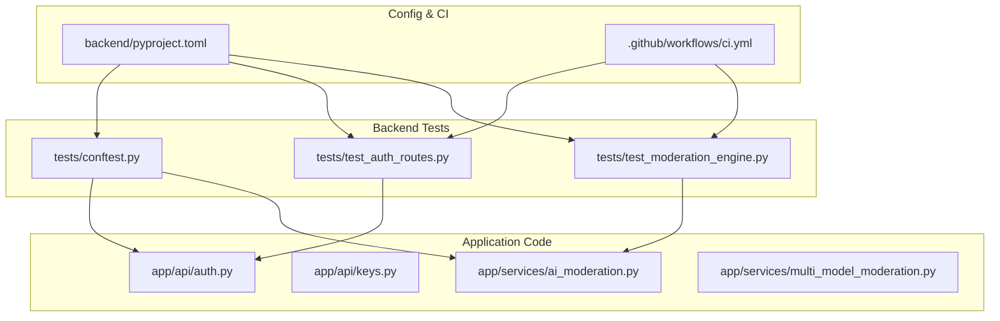
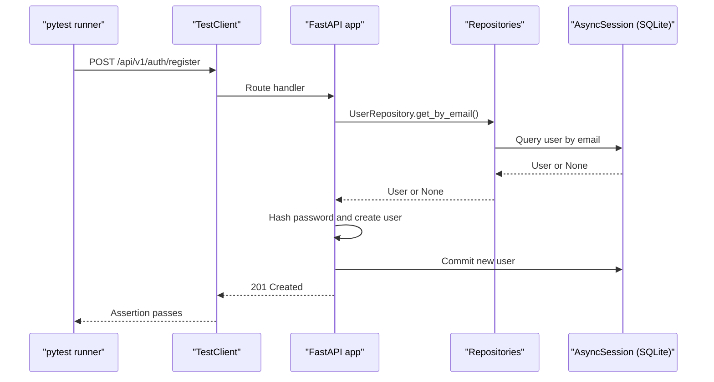
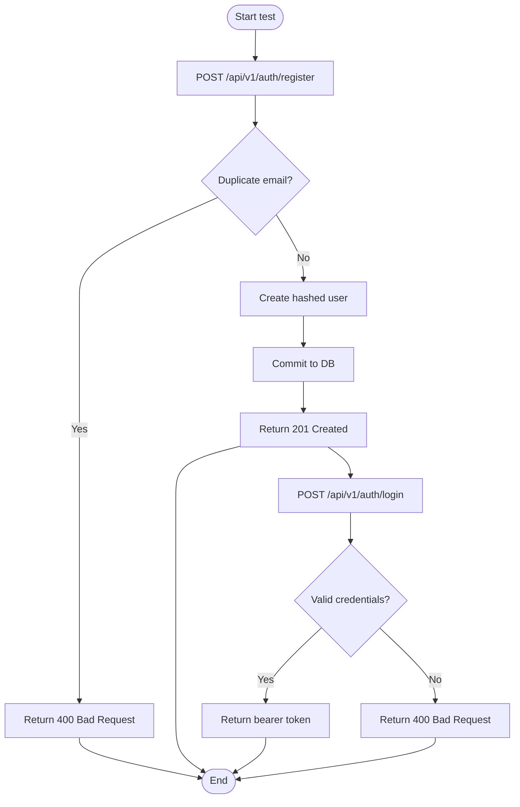
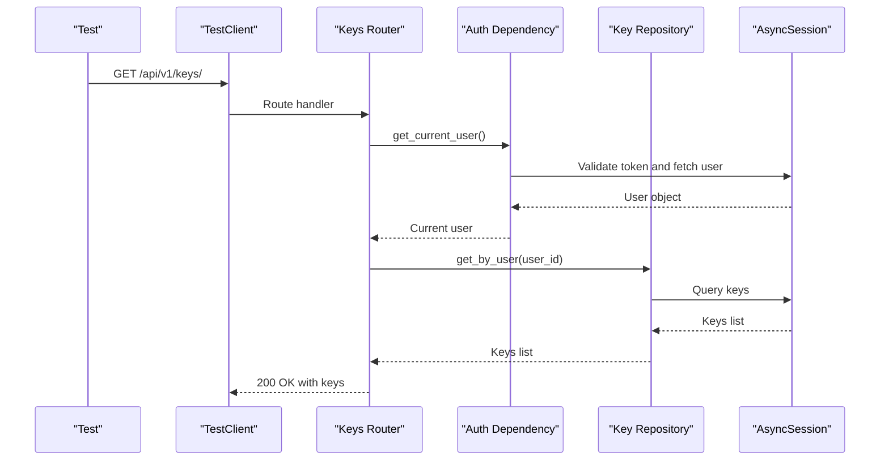
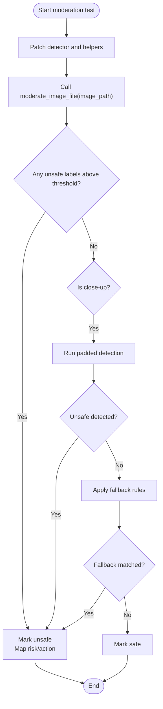
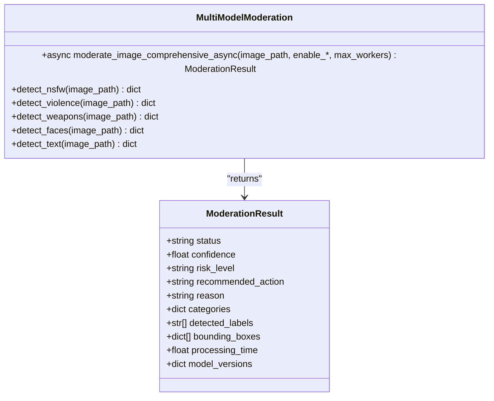
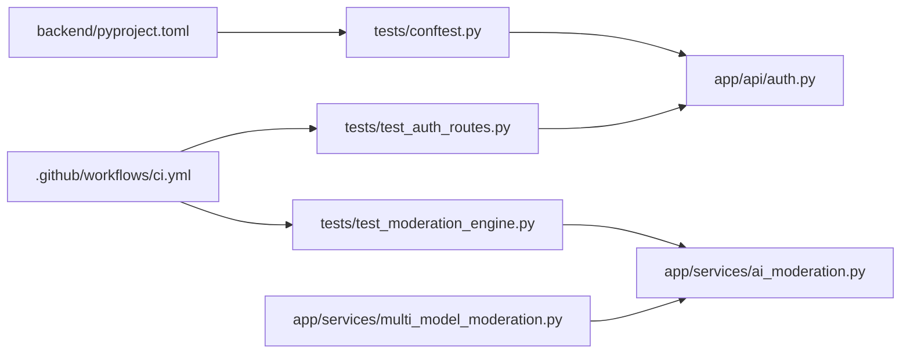

# Testing Strategy

<cite>
**Referenced Files in This Document**
- [conftest.py](file://backend/tests/conftest.py)
- [test_auth_routes.py](file://backend/tests/test_auth_routes.py)
- [test_moderation_engine.py](file://backend/tests/test_moderation_engine.py)
- [auth.py](file://backend/app/api/auth.py)
- [keys.py](file://backend/app/api/keys.py)
- [ai_moderation.py](file://backend/app/services/ai_moderation.py)
- [multi_model_moderation.py](file://backend/app/services/multi_model_moderation.py)
- [pyproject.toml](file://backend/pyproject.toml)
- [ci.yml](file://.github/workflows/ci.yml)
- [speed_test.py](file://backend/speed_test.py)
</cite>

## Table of Contents
1. Introduction
2. Project Structure
3. Core Components
4. Architecture Overview
5. Detailed Component Analysis
6. Dependency Analysis
7. Performance Considerations
8. Troubleshooting Guide
9. Conclusion

## Introduction
This document describes the testing strategy for the OmniShield platform with a focus on unit tests, integration tests, and quality assurance practices. It explains the pytest-based framework setup with async support, fixture management via conftest.py, and mocking strategies for external dependencies such as AI models and databases. It also covers coverage targets, CI automation, performance testing approaches, test data management, debugging techniques, isolation strategies, and parallel execution to accelerate feedback loops.

## Project Structure
The backend test suite is organized under backend/tests and uses FastAPI TestClient for HTTP-level integration tests and unittest.mock for service-level unit tests. Configuration for pytest, coverage, linting, and type checking is centralized in pyproject.toml. The CI pipeline runs linting, type checks, tests with coverage, and security scans.

**Diagram sources**
- [conftest.py:1-72](file://backend/tests/conftest.py#L1-L72)
- [test_auth_routes.py:1-46](file://backend/tests/test_auth_routes.py#L1-L46)
- [test_moderation_engine.py:1-92](file://backend/tests/test_moderation_engine.py#L1-L92)
- [auth.py:1-90](file://backend/app/api/auth.py#L1-L90)
- [keys.py:1-87](file://backend/app/api/keys.py#L1-L87)
- [ai_moderation.py:1-275](file://backend/app/services/ai_moderation.py#L1-L275)
- [multi_model_moderation.py:1-777](file://backend/app/services/multi_model_moderation.py#L1-L777)
- [pyproject.toml:66-95](file://backend/pyproject.toml#L66-L95)
- [ci.yml:49-113](file://.github/workflows/ci.yml#L49-L113)

**Section sources**
- [conftest.py:1-72](file://backend/tests/conftest.py#L1-L72)
- [pyproject.toml:66-95](file://backend/pyproject.toml#L66-L95)
- [ci.yml:49-113](file://.github/workflows/ci.yml#L49-L113)

## Core Components
- Pytest configuration and async mode are defined in pyproject.toml, enabling automatic asyncio handling and coverage reporting.
- conftest.py provides:
  - An isolated SQLite database engine and session factory for tests.
  - A session-scoped fixture that creates and drops tables before and after the test run.
  - A per-test AsyncSession fixture that rolls back changes automatically by scoping.
  - A TestClient fixture that overrides the application’s database dependency to use the test session.
- Authentication route tests validate registration, duplicate email handling, login success, and invalid credentials.
- Moderation engine tests mock external detectors and heuristics to assert safe, unsafe, and fallback behaviors.

Key responsibilities:
- Isolation: Each test gets its own DB session; the app’s get_db dependency is overridden.
- Mocking: External model calls (detector, close-up detection) are mocked to avoid heavy imports and non-deterministic behavior.
- Coverage: Source paths and exclusions are configured to report accurately on app code.

**Section sources**
- [pyproject.toml:66-95](file://backend/pyproject.toml#L66-L95)
- [conftest.py:1-72](file://backend/tests/conftest.py#L1-L72)
- [test_auth_routes.py:1-46](file://backend/tests/test_auth_routes.py#L1-L46)
- [test_moderation_engine.py:1-92](file://backend/tests/test_moderation_engine.py#L1-L92)

## Architecture Overview
The testing architecture layers include:
- Unit tests for services using mocks for external dependencies.
- Integration tests for API endpoints using TestClient with an in-memory SQLite database.
- CI jobs that provision Postgres and Redis services and execute tests with coverage.

**Diagram sources**
- [test_auth_routes.py:1-46](file://backend/tests/test_auth_routes.py#L1-L46)
- [auth.py:1-90](file://backend/app/api/auth.py#L1-L90)
- [conftest.py:53-72](file://backend/tests/conftest.py#L53-L72)

## Detailed Component Analysis

### Authentication Routes Testing
Scope:
- Registration endpoint: successful creation, duplicate email error.
- Login endpoint: valid credentials return bearer token; invalid credentials return error.

Implementation highlights:
- Uses TestClient to send HTTP requests against mounted routes.
- Asserts status codes and response payloads.
- Relies on conftest’s TestClient fixture which injects a test database session.

**Diagram sources**
- [test_auth_routes.py:1-46](file://backend/tests/test_auth_routes.py#L1-L46)
- [auth.py:1-90](file://backend/app/api/auth.py#L1-L90)

**Section sources**
- [test_auth_routes.py:1-46](file://backend/tests/test_auth_routes.py#L1-L46)
- [auth.py:1-90](file://backend/app/api/auth.py#L1-L90)

### API Key Management Testing
Scope:
- Create key: requires authenticated user, returns raw key once.
- List keys: returns keys owned by current user.
- Revoke key: enforces ownership and admin override.

Testing approach:
- Use TestClient with a pre-created user and JWT from login flow.
- Override authentication dependency if needed to simulate different users.
- Validate created/listed/revoked responses and authorization errors.

**Diagram sources**
- [keys.py:1-87](file://backend/app/api/keys.py#L1-L87)
- [conftest.py:53-72](file://backend/tests/conftest.py#L53-L72)

**Section sources**
- [keys.py:1-87](file://backend/app/api/keys.py#L1-L87)

### Moderation Engine Testing
Scope:
- Safe image: no detections, expected safe outcome.
- Unsafe explicit image: high-confidence label triggers unsafe outcome.
- Fallback rules: close-up heuristic infers risk when specific conditions match.

Mocking strategy:
- Patch detector and helper functions to control outputs deterministically.
- Provide a temporary dummy image file path for processing.

**Diagram sources**
- [test_moderation_engine.py:1-92](file://backend/tests/test_moderation_engine.py#L1-L92)
- [ai_moderation.py:1-275](file://backend/app/services/ai_moderation.py#L1-L275)

**Section sources**
- [test_moderation_engine.py:1-92](file://backend/tests/test_moderation_engine.py#L1-L92)
- [ai_moderation.py:1-275](file://backend/app/services/ai_moderation.py#L1-L275)

### Multi-Model Ensemble Voting and Confidence Calibration
Scope:
- Parallel execution across multiple detectors (NSFW, violence, weapons, faces, text).
- Aggregation logic combines results, applies safety overrides, and maps risk levels to actions.
- Confidence calibration uses highest unsafe confidence or average safe confidence.

Testing approach:
- For unit tests, mock each detector function to return controlled category results.
- For integration-style tests, call the orchestrator with real files while mocking heavy model loads.
- Validate final ModerationResult fields: status, confidence, risk_level, recommended_action, categories, labels, boxes, processing_time, model_versions.

**Diagram sources**
- [multi_model_moderation.py:1-777](file://backend/app/services/multi_model_moderation.py#L1-L777)

**Section sources**
- [multi_model_moderation.py:1-777](file://backend/app/services/multi_model_moderation.py#L1-L777)

## Dependency Analysis
- Tests depend on:
  - FastAPI TestClient for HTTP interactions.
  - SQLAlchemy async engine/session for isolated DB state.
  - unittest.mock for patching external modules and functions.
- Application components under test:
  - auth.py endpoints rely on repositories and security utilities.
  - ai_moderation.py depends on NudeDetector and PIL.
  - multi_model_moderation.py orchestrates multiple detectors and aggregates outcomes.

**Diagram sources**
- [conftest.py:1-72](file://backend/tests/conftest.py#L1-L72)
- [test_auth_routes.py:1-46](file://backend/tests/test_auth_routes.py#L1-L46)
- [test_moderation_engine.py:1-92](file://backend/tests/test_moderation_engine.py#L1-L92)
- [auth.py:1-90](file://backend/app/api/auth.py#L1-L90)
- [ai_moderation.py:1-275](file://backend/app/services/ai_moderation.py#L1-L275)
- [multi_model_moderation.py:1-777](file://backend/app/services/multi_model_moderation.py#L1-L777)
- [pyproject.toml:66-95](file://backend/pyproject.toml#L66-L95)
- [ci.yml:49-113](file://.github/workflows/ci.yml#L49-L113)

**Section sources**
- [conftest.py:1-72](file://backend/tests/conftest.py#L1-L72)
- [pyproject.toml:66-95](file://backend/pyproject.toml#L66-L95)
- [ci.yml:49-113](file://.github/workflows/ci.yml#L49-L113)

## Performance Considerations
Strategies:
- Benchmark cache hits: Add tests that exercise hash-based caching paths and assert reduced processing times for repeated inputs.
- Model inference timing: Measure time around detector calls and assert acceptable latency thresholds.
- Concurrent request handling: Use concurrent.futures or asyncio to simulate multiple requests and verify throughput and stability.
- Existing speed utility: A simple script demonstrates measuring NudeDetector inference time for a single image.

Recommendations:
- Introduce pytest-benchmark for regression tracking of critical paths.
- Separate micro-benchmarks for NSFW, violence, weapons, faces, and text detectors.
- Track processing_time fields returned by moderation services to build dashboards over time.

[No sources needed since this section provides general guidance]

## Troubleshooting Guide
Common issues and fixes:
- Async event loop conflicts during DB setup: Ensure fixtures initialize and tear down engines within proper event loops and clear dependency overrides after tests.
- Missing system libraries for ML models: CI installs required OS packages; locally ensure similar environment.
- Slow imports due to heavy models: Keep lazy loading and mocking in place for tests to avoid long startup times.
- Flaky network or external API calls: Always mock external dependencies and provide deterministic responses.

Debugging techniques:
- Use pytest -vv and --tb=short to reduce noise.
- Print or log intermediate values inside patched functions to confirm mock behavior.
- Temporarily disable parallelism (-n 0) to isolate concurrency-related failures.
- Inspect coverage reports to identify untested branches and add assertions.

**Section sources**
- [conftest.py:1-72](file://backend/tests/conftest.py#L1-L72)
- [ci.yml:87-105](file://.github/workflows/ci.yml#L87-L105)

## Conclusion
The OmniShield testing strategy combines isolated integration tests for authentication and API key endpoints with robust unit tests for the moderation engine through careful mocking. Pytest configuration enables async support and accurate coverage reporting, while CI automates execution and quality gates. Extending the suite with performance benchmarks, richer test datasets, and parallel execution will further improve reliability and developer productivity.