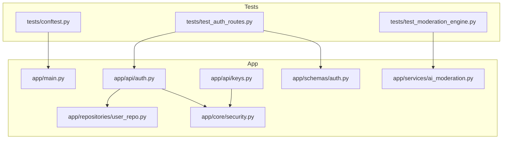
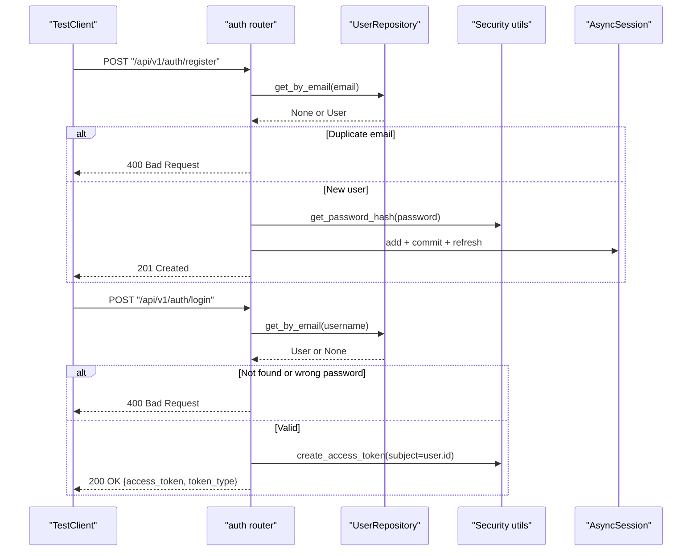
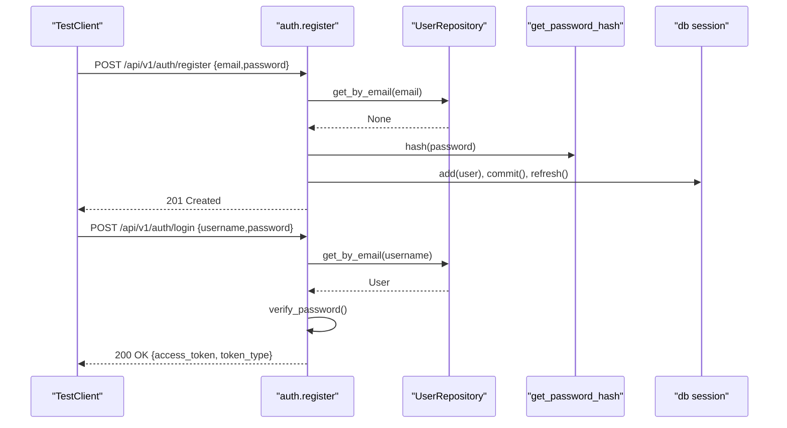
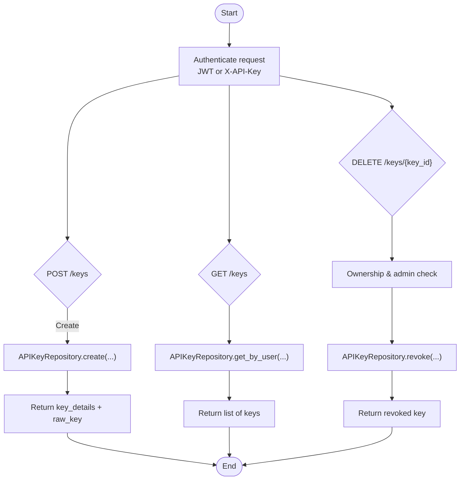
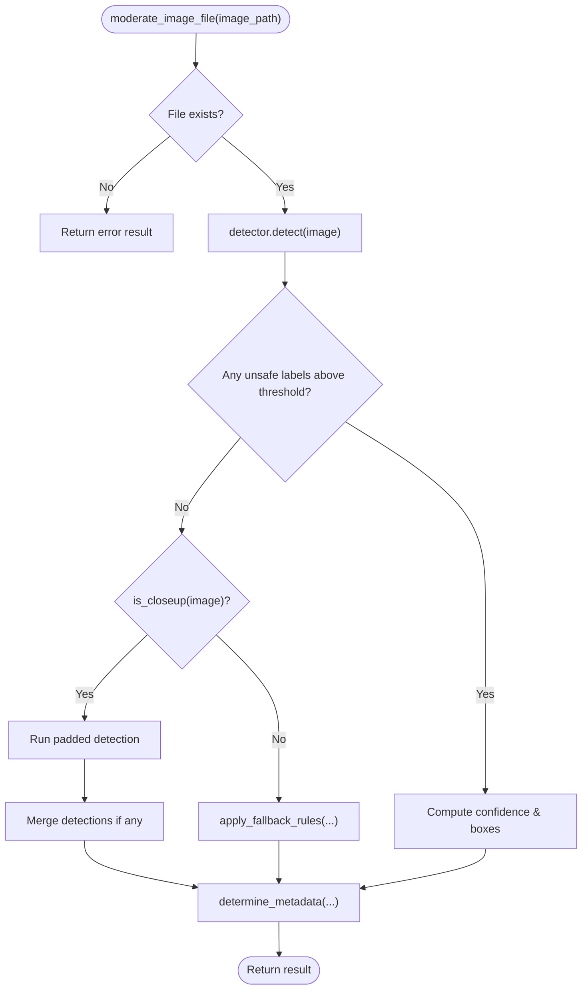
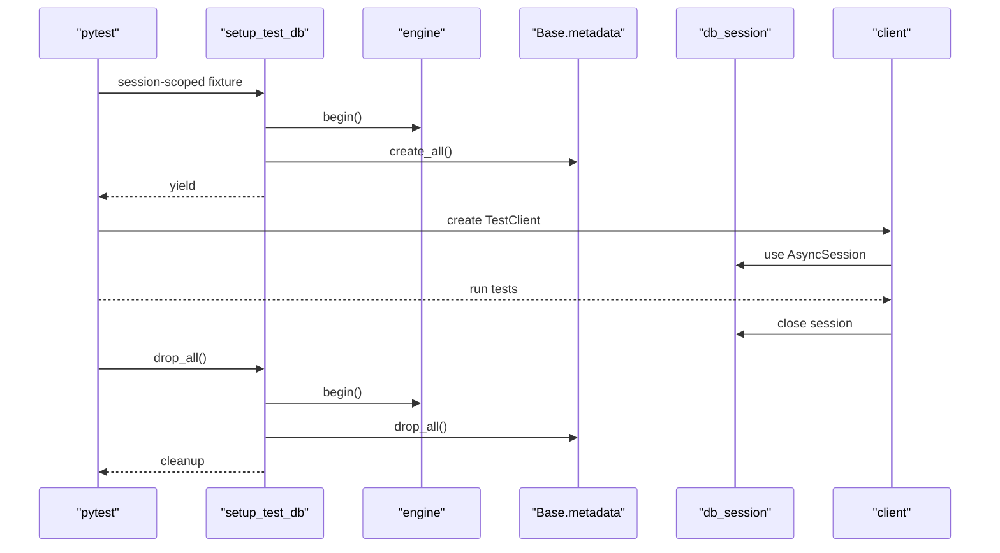
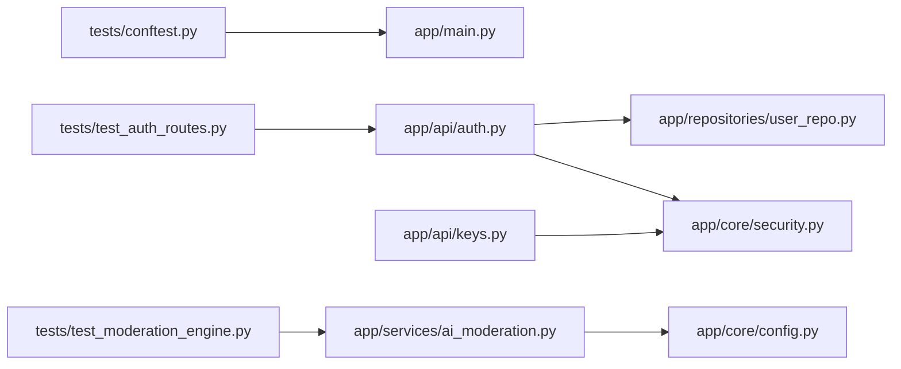

# Unit Testing

<cite>
**Referenced Files in This Document**
- [conftest.py](file://backend/tests/conftest.py)
- [test_auth_routes.py](file://backend/tests/test_auth_routes.py)
- [test_moderation_engine.py](file://backend/tests/test_moderation_engine.py)
- [auth.py](file://backend/app/api/auth.py)
- [keys.py](file://backend/app/api/keys.py)
- [security.py](file://backend/app/core/security.py)
- [user_repo.py](file://backend/app/repositories/user_repo.py)
- [ai_moderation.py](file://backend/app/services/ai_moderation.py)
- [auth.py](file://backend/app/schemas/auth.py)
- [pyproject.toml](file://backend/pyproject.toml)
</cite>

## Table of Contents
1. Introduction
2. Project Structure
3. Core Components
4. Architecture Overview
5. Detailed Component Analysis
6. Dependency Analysis
7. Performance Considerations
8. Troubleshooting Guide
9. Conclusion

## Introduction
This document provides comprehensive unit testing guidance for the OmniShield platform, focusing on isolated component validation and pytest-based strategies. It covers:
- Async test support with @pytest.mark.asyncio
- FastAPI TestClient configuration and dependency overrides
- Fixture management via conftest.py
- Authentication route tests (registration, login, JWT behavior)
- API key management operations
- Mocking strategies for external dependencies (database, Redis, AI models, file storage)
- Test data management and factory patterns
- Isolation techniques, transaction rollback, and cleanup procedures
- Examples for testing utility functions, service layer methods, and repository implementations using dependency injection and mocks

## Project Structure
The backend test suite is organized under backend/tests with a shared fixture configuration and focused test modules. The application follows a layered architecture with API routers, repositories, services, schemas, and core utilities.

**Diagram sources**
- [conftest.py:1-72](file://backend/tests/conftest.py#L1-L72)
- [test_auth_routes.py:1-46](file://backend/tests/test_auth_routes.py#L1-L46)
- [test_moderation_engine.py:1-92](file://backend/tests/test_moderation_engine.py#L1-L92)
- [auth.py:1-90](file://backend/app/api/auth.py#L1-L90)
- [keys.py:1-87](file://backend/app/api/keys.py#L1-L87)
- [security.py:1-177](file://backend/app/core/security.py#L1-L177)
- [user_repo.py:1-40](file://backend/app/repositories/user_repo.py#L1-L40)
- [ai_moderation.py:1-275](file://backend/app/services/ai_moderation.py#L1-L275)
- [auth.py:1-35](file://backend/app/schemas/auth.py#L1-L35)

**Section sources**
- [conftest.py:1-72](file://backend/tests/conftest.py#L1-L72)
- [pyproject.toml:66-73](file://backend/pyproject.toml#L66-L73)

## Core Components
- Test configuration and fixtures:
  - Session-scoped database setup and teardown using an isolated SQLite database
  - Per-test async database session with automatic rollback semantics
  - TestClient configured to override get_db dependency
- Authentication routes:
  - Registration endpoint with duplicate email validation
  - Login endpoint returning JWT tokens
- Moderation engine:
  - Image moderation service with mocked NudeDetector and helper functions
- Security utilities:
  - Password hashing/verification, JWT creation/validation, current user resolution
- Repository layer:
  - User repository with CRUD operations used by auth endpoints

**Section sources**
- [conftest.py:16-72](file://backend/tests/conftest.py#L16-L72)
- [test_auth_routes.py:1-46](file://backend/tests/test_auth_routes.py#L1-L46)
- [test_moderation_engine.py:1-92](file://backend/tests/test_moderation_engine.py#L1-L92)
- [auth.py:1-90](file://backend/app/api/auth.py#L1-L90)
- [security.py:1-177](file://backend/app/core/security.py#L1-L177)
- [user_repo.py:1-40](file://backend/app/repositories/user_repo.py#L1-L40)
- [ai_moderation.py:1-275](file://backend/app/services/ai_moderation.py#L1-L275)

## Architecture Overview
The test harness integrates with FastAPI’s dependency injection to provide isolated resources per test run. The authentication flow uses OAuth2 password form submission, repository lookups, and JWT issuance. The moderation engine relies on an external model that is mocked during tests.

**Diagram sources**
- [auth.py:15-90](file://backend/app/api/auth.py#L15-L90)
- [user_repo.py:1-40](file://backend/app/repositories/user_repo.py#L1-L40)
- [security.py:28-51](file://backend/app/core/security.py#L28-L51)
- [conftest.py:53-72](file://backend/tests/conftest.py#L53-L72)

## Detailed Component Analysis

### Authentication Routes Tests
- Registration:
  - Validates successful creation and role assignment
  - Enforces duplicate email rejection with appropriate error detail
- Login:
  - Verifies correct credentials return a bearer token
  - Confirms incorrect credentials return a 400 error with expected message

Implementation notes:
- Uses TestClient to send HTTP requests against mounted routers
- Assertions check status codes and response payloads
- No explicit async client usage; synchronous TestClient is sufficient for these endpoints

**Section sources**
- [test_auth_routes.py:1-46](file://backend/tests/test_auth_routes.py#L1-L46)
- [auth.py:15-90](file://backend/app/api/auth.py#L15-L90)
- [auth.py:11-14](file://backend/app/schemas/auth.py#L11-L14)

#### Sequence Diagram: Registration and Login Flow

**Diagram sources**
- [auth.py:15-90](file://backend/app/api/auth.py#L15-L90)
- [user_repo.py:16-20](file://backend/app/repositories/user_repo.py#L16-L20)
- [security.py:28-40](file://backend/app/core/security.py#L28-L40)

### API Key Management Operations
Key operations include creating, listing, and revoking API keys. These endpoints rely on authenticated users and repository methods.

Testing strategy:
- Use TestClient with Authorization Bearer header obtained from login
- Validate ownership checks and authorization errors
- Assert responses match schema expectations

**Diagram sources**
- [keys.py:14-87](file://backend/app/api/keys.py#L14-L87)
- [security.py:53-93](file://backend/app/core/security.py#L53-L93)

**Section sources**
- [keys.py:14-87](file://backend/app/api/keys.py#L14-L87)
- [security.py:53-93](file://backend/app/core/security.py#L53-L93)

### Moderation Engine Tests
The image moderation service is tested by mocking external components:
- get_detector returns a MagicMock detector
- is_closeup returns controlled values
- Temporary dummy images are created and cleaned up

Assertions cover:
- Safe images returning low risk and allow action
- Unsafe explicit content returning critical risk and block action
- Close-up heuristic fallback producing inferred labels and quarantine action

**Diagram sources**
- [ai_moderation.py:148-275](file://backend/app/services/ai_moderation.py#L148-L275)
- [test_moderation_engine.py:24-92](file://backend/tests/test_moderation_engine.py#L24-L92)

**Section sources**
- [test_moderation_engine.py:1-92](file://backend/tests/test_moderation_engine.py#L1-L92)
- [ai_moderation.py:1-275](file://backend/app/services/ai_moderation.py#L1-L275)

### Conftest Fixtures and Database Isolation
Key aspects:
- Session-scoped setup creates and drops tables using an isolated SQLite file
- Per-test db_session provides an AsyncSession that is rolled back after each test
- TestClient overrides get_db to inject the test session and clears overrides afterward

**Diagram sources**
- [conftest.py:26-72](file://backend/tests/conftest.py#L26-L72)

**Section sources**
- [conftest.py:1-72](file://backend/tests/conftest.py#L1-L72)

### Security Utilities and JWT Behavior
- Password hashing and verification are deterministic and safe for unit tests
- JWT creation encodes subject and expiration based on settings
- Current user resolution decodes token and queries the database

Testing considerations:
- For protected endpoints, generate a valid token using security utilities and pass it via Authorization header
- For API key flows, set X-API-Key header and mock repository methods accordingly

**Section sources**
- [security.py:28-93](file://backend/app/core/security.py#L28-L93)

### Repository Layer Testing Patterns
- UserRepository methods execute SQL queries through AsyncSession
- In tests, inject a mock or real session depending on scope
- For pure logic tests, consider patching repository calls at the service layer to isolate behavior

**Section sources**
- [user_repo.py:1-40](file://backend/app/repositories/user_repo.py#L1-L40)

## Dependency Analysis
The following diagram shows how tests depend on application components and where mocks are applied.

**Diagram sources**
- [conftest.py:1-72](file://backend/tests/conftest.py#L1-L72)
- [test_auth_routes.py:1-46](file://backend/tests/test_auth_routes.py#L1-L46)
- [test_moderation_engine.py:1-92](file://backend/tests/test_moderation_engine.py#L1-L92)
- [auth.py:1-90](file://backend/app/api/auth.py#L1-L90)
- [keys.py:1-87](file://backend/app/api/keys.py#L1-L87)
- [ai_moderation.py:1-275](file://backend/app/services/ai_moderation.py#L1-L275)
- [user_repo.py:1-40](file://backend/app/repositories/user_repo.py#L1-L40)
- [security.py:1-177](file://backend/app/core/security.py#L1-L177)

**Section sources**
- [pyproject.toml:66-73](file://backend/pyproject.toml#L66-L73)

## Performance Considerations
- Prefer in-memory or lightweight databases (SQLite) for fast unit tests
- Keep test scopes minimal: avoid heavy initialization in session-scoped fixtures unless necessary
- Mock expensive I/O (AI models, network calls) to reduce flakiness and runtime
- Reuse small, deterministic test data and avoid large payloads when not required

[No sources needed since this section provides general guidance]

## Troubleshooting Guide
Common issues and resolutions:
- Event loop conflicts in session-scoped fixtures:
  - Use a new event loop for table creation/dropping and ensure proper cleanup
- Database isolation failures:
  - Verify per-test session rollback and clear dependency overrides after tests
- Missing imports or path issues:
  - Ensure sys.path includes backend root so tests can import app modules
- External model initialization slowness:
  - Mock get_detector and related helpers to avoid loading heavy models during tests

**Section sources**
- [conftest.py:26-52](file://backend/tests/conftest.py#L26-L52)
- [test_moderation_engine.py:24-33](file://backend/tests/test_moderation_engine.py#L24-L33)

## Conclusion
The OmniShield test suite demonstrates robust patterns for isolated unit testing:
- Clear fixture management with isolated database sessions and TestClient overrides
- Comprehensive authentication route coverage including duplicate registration and credential validation
- Effective mocking of external AI services for reliable moderation engine tests
- Strong separation of concerns enabling targeted testing of repositories, services, and security utilities

Adopt these patterns to extend coverage across additional endpoints and services while maintaining speed, reliability, and clarity.