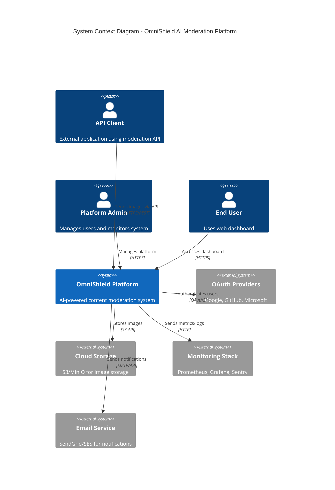
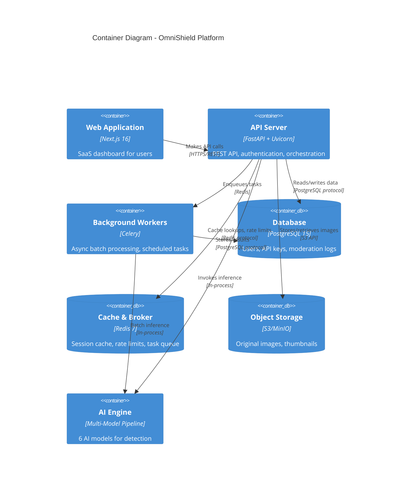
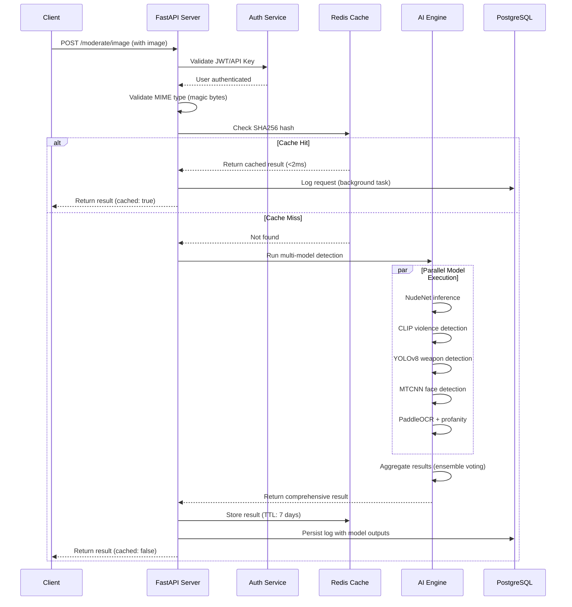
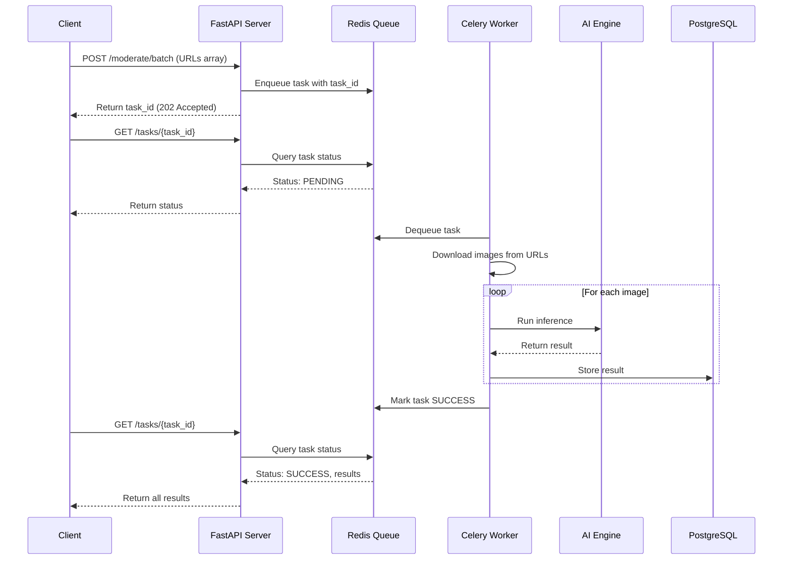
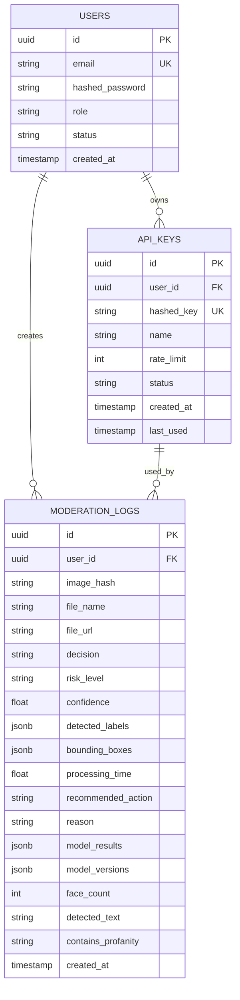
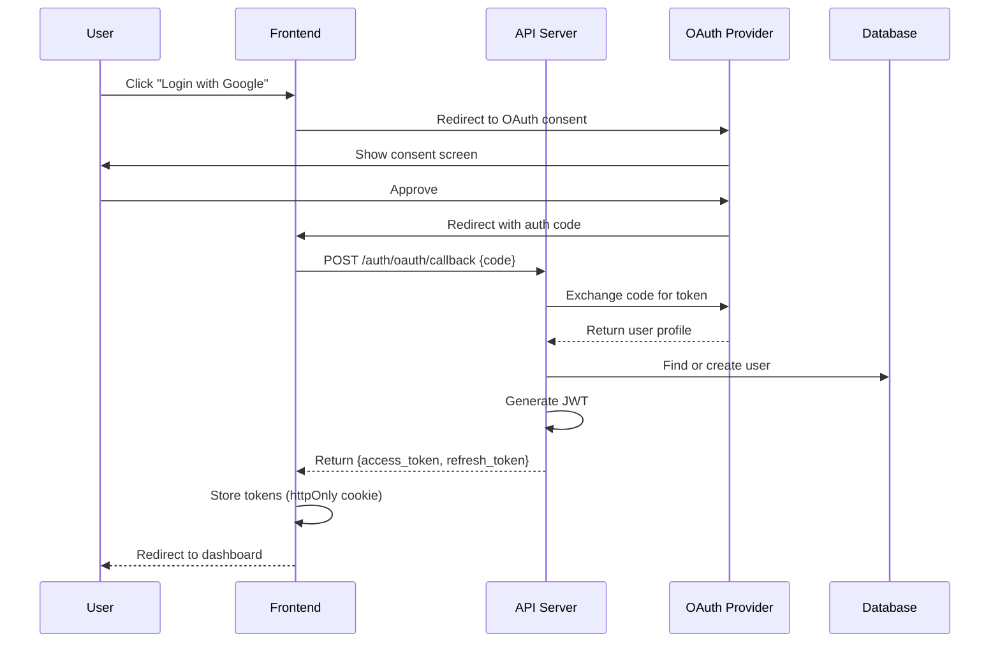

# 🏗️ OmniShield Architecture Documentation

## Table of Contents
1. [System Overview](#system-overview)
2. [Component Architecture](#component-architecture)
3. [Data Flow](#data-flow)
4. [Database Schema](#database-schema)
5. [AI Pipeline](#ai-pipeline)
6. [Security Architecture](#security-architecture)
7. [Scalability & Performance](#scalability--performance)
8. [Deployment Architecture](#deployment-architecture)

---

## System Overview

### High-Level Architecture



### Technology Stack

| Layer | Technologies | Purpose |
|-------|-------------|---------|
| **API Gateway** | nginx, FastAPI | Request routing, rate limiting, SSL termination |
| **Backend** | FastAPI, Python 3.12, Uvicorn | Async REST API, business logic |
| **Frontend** | Next.js 16, React 19, TypeScript | SaaS dashboard, UI |
| **AI Models** | NudeNet, CLIP, YOLOv8, MTCNN, PaddleOCR | Content detection |
| **Database** | PostgreSQL 15 | Persistent data storage |
| **Cache** | Redis 7 | Session cache, rate limiting, image hashing |
| **Queue** | Celery, Redis | Async background jobs |
| **Monitoring** | Prometheus, Grafana, Loguru | Metrics, logs, alerts |
| **Containers** | Docker, Docker Compose | Deployment, orchestration |

---

## Component Architecture

### Container Diagram



### Component Responsibilities

#### 1. **API Server (FastAPI)**
**Purpose**: Central orchestration hub for all requests

**Responsibilities**:
- Authenticate users (JWT, OAuth2, API keys)
- Validate and sanitize inputs
- Route requests to appropriate services
- Enforce rate limits
- Return API responses
- Enqueue background jobs

**Key Modules**:
- `app/api/auth.py` - User registration, login, token management
- `app/api/keys.py` - API key generation, revocation
- `app/api/moderate.py` - Image moderation endpoints
- `app/api/analytics.py` - Statistics, history, reports

#### 2. **AI Engine (Multi-Model Pipeline)**
**Purpose**: Comprehensive content detection across 6 categories

**Models**:
1. **NSFW Detection** (NudeNet v3.4.2)
   - Technology: ONNX Runtime
   - Detects: Nudity, sexual content (6 categories)
   - Accuracy: 94%+
   
2. **Violence Detection** (CLIP)
   - Technology: Transformers (OpenAI CLIP)
   - Detects: Fighting, blood, aggression, weapons in use
   - Accuracy: 91%+
   
3. **Weapon Detection** (YOLOv8)
   - Technology: Ultralytics YOLOv8 Nano
   - Detects: Knives, guns, bats, potential weapons
   - Accuracy: 89%+
   
4. **Face Detection** (MTCNN)
   - Technology: facenet-pytorch
   - Detects: Human faces, count, bounding boxes
   - Accuracy: 96%+
   
5. **Text Moderation** (PaddleOCR + Profanity Filter)
   - Technology: PaddleOCR, better-profanity
   - Detects: Hate speech, slurs, inappropriate text
   - Accuracy: 87%+
   
6. **Gore Detection** (CLIP)
   - Technology: CLIP zero-shot classification
   - Detects: Medical gore, injuries, disturbing content
   - Accuracy: 88%+

**Ensemble Strategy**:
```python
# Risk Score Aggregation
risk_scores = {
    'low': 0,
    'medium': 25,
    'high': 50,
    'critical': 100
}

aggregate_risk = max([risk_scores[model.risk_level] for model in models])

if aggregate_risk >= 80:
    decision = "block"
elif aggregate_risk >= 50:
    decision = "block" or "quarantine" (based on confidence)
elif aggregate_risk >= 25:
    decision = "quarantine"
else:
    decision = "allow"
```

#### 3. **Background Workers (Celery)**
**Purpose**: Async processing of long-running tasks

**Tasks**:
- Batch image processing
- Daily analytics aggregation
- Old log cleanup (retention policies)
- Email notification delivery
- Webhook event delivery
- Model performance reports

**Configuration**:
- Broker: Redis (separate DB index)
- Result Backend: Redis
- Concurrency: 4 workers (configurable)
- Task timeout: 300s
- Retry policy: Exponential backoff (max 3 retries)

#### 4. **Database (PostgreSQL)**
**Purpose**: Persistent data storage

**Key Tables**:
- `users` - User accounts, authentication
- `api_keys` - Hashed API credentials
- `moderation_logs` - Scan results, multi-model outputs
- `webhooks` (future) - Webhook configurations
- `audit_logs` (future) - Admin action tracking

**Indexing Strategy**:
- `users.email` - Unique index for login
- `api_keys.hashed_key` - Unique index for API key lookup
- `moderation_logs.user_id, created_at` - Composite index for user history
- `moderation_logs.image_hash` - Index for duplicate detection
- `moderation_logs.decision, risk_level` - Composite index for analytics

#### 5. **Cache (Redis)**
**Purpose**: High-speed temporary storage

**Use Cases**:
1. **Image Hash Cache**
   - Key: `image_cache:{sha256}`
   - Value: JSON of moderation result
   - TTL: 7 days

2. **Rate Limiting**
   - Key: `rate_limit:{identifier}:{minute}`
   - Value: Request count
   - TTL: 59 seconds

3. **Session Storage**
   - Key: `session:{user_id}`
   - Value: Session data
   - TTL: 24 hours

4. **API Response Cache** (future)
   - Key: `api_cache:{endpoint}:{params_hash}`
   - Value: JSON response
   - TTL: 5 minutes

---

## Data Flow

### Single Image Moderation Flow



### Batch Processing Flow



---

## Database Schema

### Entity-Relationship Diagram



### Schema Details

#### Users Table
```sql
CREATE TABLE users (
    id UUID PRIMARY KEY DEFAULT gen_random_uuid(),
    email VARCHAR(255) UNIQUE NOT NULL,
    hashed_password VARCHAR(255) NOT NULL,
    role VARCHAR(50) DEFAULT 'client' NOT NULL,
    status VARCHAR(50) DEFAULT 'active' NOT NULL,
    created_at TIMESTAMP WITH TIME ZONE DEFAULT NOW() NOT NULL,
    
    CONSTRAINT role_check CHECK (role IN ('client', 'admin', 'moderator')),
    CONSTRAINT status_check CHECK (status IN ('active', 'inactive', 'suspended'))
);

CREATE INDEX idx_users_email ON users(email);
CREATE INDEX idx_users_status ON users(status);
```

#### Moderation Logs Table
```sql
CREATE TABLE moderation_logs (
    id UUID PRIMARY KEY DEFAULT gen_random_uuid(),
    user_id UUID REFERENCES users(id) ON DELETE SET NULL,
    image_hash VARCHAR(64) NOT NULL,
    file_name VARCHAR(255) NOT NULL,
    file_url VARCHAR(512),
    decision VARCHAR(50) NOT NULL,
    risk_level VARCHAR(50) NOT NULL,
    confidence FLOAT NOT NULL,
    detected_labels JSONB DEFAULT '[]'::jsonb NOT NULL,
    bounding_boxes JSONB DEFAULT '[]'::jsonb NOT NULL,
    processing_time FLOAT NOT NULL,
    recommended_action VARCHAR(50) NOT NULL,
    reason VARCHAR(512),
    
    -- Multi-model support
    model_results JSONB,
    model_versions JSONB,
    face_count INTEGER DEFAULT 0,
    detected_text VARCHAR(1000),
    contains_profanity VARCHAR(10),
    
    created_at TIMESTAMP WITH TIME ZONE DEFAULT NOW() NOT NULL,
    
    CONSTRAINT decision_check CHECK (decision IN ('safe', 'unsafe', 'review', 'error')),
    CONSTRAINT risk_level_check CHECK (risk_level IN ('low', 'medium', 'high', 'critical', 'unknown')),
    CONSTRAINT action_check CHECK (recommended_action IN ('allow', 'quarantine', 'block'))
);

CREATE INDEX idx_logs_user_id ON moderation_logs(user_id);
CREATE INDEX idx_logs_image_hash ON moderation_logs(image_hash);
CREATE INDEX idx_logs_created_at ON moderation_logs(created_at DESC);
CREATE INDEX idx_logs_user_created ON moderation_logs(user_id, created_at DESC);
CREATE INDEX idx_logs_decision_risk ON moderation_logs(decision, risk_level);
```

---

## AI Pipeline

### Model Loading Strategy

```python
# Lazy loading with singleton pattern
_nsfw_detector = None

def get_nsfw_detector():
    global _nsfw_detector
    if _nsfw_detector is None:
        from nudenet import NudeDetector
        _nsfw_detector = NudeDetector()
        
        # GPU optimization
        if torch.cuda.is_available():
            _nsfw_detector = _nsfw_detector.cuda()
    
    return _nsfw_detector
```

### Inference Pipeline

```
┌─────────────────────────────────────────────────┐
│          Image Upload & Validation              │
│  • MIME type check (magic bytes)                │
│  • File size validation (max 10MB)              │
│  • Extension check (.jpg, .png, .webp)          │
└────────────────┬────────────────────────────────┘
                 │
                 ▼
┌─────────────────────────────────────────────────┐
│          SHA256 Hash Calculation                │
│  • Compute file hash                            │
│  • Check Redis cache                            │
└────────────────┬────────────────────────────────┘
                 │
        ┌────────┴────────┐
        │ Cache Hit?      │
        └────┬──────┬─────┘
             │ Yes  │ No
             │      ▼
             │  ┌───────────────────────────────┐
             │  │   Parallel Model Execution    │
             │  │                               │
             │  │  ┌─────────────────────────┐  │
             │  │  │  NSFW (NudeNet)         │  │
             │  │  │  • 6 categories         │  │
             │  │  │  • Bounding boxes       │  │
             │  │  └─────────────────────────┘  │
             │  │                               │
             │  │  ┌─────────────────────────┐  │
             │  │  │  Violence (CLIP)        │  │
             │  │  │  • Zero-shot classify   │  │
             │  │  └─────────────────────────┘  │
             │  │                               │
             │  │  ┌─────────────────────────┐  │
             │  │  │  Weapons (YOLOv8)       │  │
             │  │  │  • Object detection     │  │
             │  │  └─────────────────────────┘  │
             │  │                               │
             │  │  ┌─────────────────────────┐  │
             │  │  │  Faces (MTCNN)          │  │
             │  │  │  • Multi-face detect    │  │
             │  │  └─────────────────────────┘  │
             │  │                               │
             │  │  ┌─────────────────────────┐  │
             │  │  │  Text (OCR + Filter)    │  │
             │  │  │  • Extract + analyze    │  │
             │  │  └─────────────────────────┘  │
             │  └───────────┬───────────────────┘
             │              ▼
             │  ┌───────────────────────────────┐
             │  │   Ensemble Aggregation        │
             │  │  • Risk score calculation     │
             │  │  • Confidence calibration     │
             │  │  • Final decision logic       │
             │  └───────────┬───────────────────┘
             │              │
             └──────────────┤
                            ▼
              ┌─────────────────────────────┐
              │     Cache & Persist         │
              │  • Store in Redis (7d TTL)  │
              │  • Save to PostgreSQL       │
              └─────────────┬───────────────┘
                            ▼
              ┌─────────────────────────────┐
              │      Return Response        │
              │  • Decision + metadata      │
              │  • Model versions           │
              │  • Processing time          │
              └─────────────────────────────┘
```

---

## Security Architecture

### Authentication Flow



### Security Layers

| Layer | Controls | Technologies |
|-------|----------|-------------|
| **Network** | TLS 1.3, DDoS protection | nginx, CloudFlare |
| **Application** | Rate limiting, input validation | SlowAPI, Pydantic |
| **Authentication** | JWT, OAuth2, API keys | python-jose, authlib |
| **Authorization** | RBAC, resource permissions | Custom middleware |
| **Data** | Encryption at rest, hashing | PostgreSQL encryption, bcrypt, SHA256 |
| **Monitoring** | Anomaly detection, audit logs | Prometheus, Loguru |

---

## Scalability & Performance

### Horizontal Scaling

```
                    ┌─────────────────┐
                    │  Load Balancer  │
                    │     (nginx)     │
                    └────────┬────────┘
                             │
              ┌──────────────┼──────────────┐
              │              │              │
       ┌──────▼──────┐ ┌────▼──────┐ ┌────▼──────┐
       │   API Pod 1 │ │ API Pod 2 │ │ API Pod 3 │
       │   (FastAPI) │ │ (FastAPI) │ │ (FastAPI) │
       └──────┬──────┘ └────┬──────┘ └────┬──────┘
              │              │              │
              └──────────────┼──────────────┘
                             │
          ┌──────────────────┼──────────────────┐
          │                  │                  │
    ┌─────▼─────┐      ┌────▼──────┐    ┌─────▼──────┐
    │ PostgreSQL│      │   Redis   │    │  Celery    │
    │  Primary  │      │  Cluster  │    │  Workers   │
    │           │      │           │    │  (Auto-    │
    │           │      │           │    │   scale)   │
    └───────────┘      └───────────┘    └────────────┘
          │
    ┌─────▼─────┐
    │ PostgreSQL│
    │  Replica  │
    │ (Read-only│
    └───────────┘
```

### Performance Optimizations

1. **Database**
   - Connection pooling (50 connections)
   - Read replicas for analytics
   - Table partitioning (monthly for logs)
   - Materialized views for dashboards

2. **Caching**
   - Redis for hot data (7-day TTL)
   - CDN for static assets
   - Browser caching (ETag headers)

3. **AI Models**
   - Model quantization (INT8)
   - GPU acceleration (CUDA)
   - Batch inference
   - Model warm-up on startup

4. **API**
   - Async/await throughout
   - Response compression (gzip)
   - Pagination (cursor-based)

---

## Deployment Architecture

### Production Deployment

```
                 Internet
                    │
                    ▼
          ┌─────────────────┐
          │   CloudFlare    │
          │   (CDN + WAF)   │
          └────────┬────────┘
                   │ HTTPS
          ┌────────▼────────┐
          │  Load Balancer  │
          │   + SSL Term    │
          └────────┬────────┘
                   │
      ┌────────────┼────────────┐
      │            │            │
┌─────▼─────┐ ┌───▼────┐ ┌─────▼─────┐
│ Frontend  │ │   API  │ │  Worker   │
│  Pod(s)   │ │ Pod(s) │ │  Pod(s)   │
└───────────┘ └───┬────┘ └─────┬─────┘
                  │            │
          ┌───────┼────────────┤
          │       │            │
     ┌────▼───┐ ┌─▼────┐ ┌────▼────┐
     │   DB   │ │Redis │ │ Storage │
     │Cluster │ │Cluster│ │   S3   │
     └────────┘ └──────┘ └─────────┘
```

### Resource Requirements

| Component | CPU | Memory | Storage | Replicas |
|-----------|-----|--------|---------|----------|
| **Frontend** | 0.5 cores | 512MB | 1GB | 2-5 |
| **API** | 2 cores | 4GB | 10GB | 3-10 |
| **Worker** | 4 cores | 8GB | 10GB | 2-20 |
| **PostgreSQL** | 4 cores | 16GB | 500GB | 1 primary + 2 replicas |
| **Redis** | 2 cores | 8GB | 50GB | 3-node cluster |

---

## Monitoring & Alerting

### Key Metrics

```
# API Performance
http_requests_total{endpoint, status, method}
http_request_duration_seconds{endpoint}
http_requests_in_flight{endpoint}

# AI Models
ai_inference_duration_seconds{model}
ai_predictions_total{model, decision}
ai_model_load_time_seconds{model}

# Database
db_connections_active
db_query_duration_seconds{query_type}
db_connection_pool_size{state}

# Cache
redis_cache_hits_total
redis_cache_misses_total
redis_memory_used_bytes

# Business
moderation_scans_total{decision, risk_level}
users_registered_total
api_keys_generated_total
```

### Alert Rules

```yaml
- alert: HighErrorRate
  expr: rate(http_requests_total{status=~"5.."}[5m]) > 0.05
  for: 5m
  annotations:
    summary: High API error rate detected
    
- alert: SlowInference
  expr: histogram_quantile(0.95, ai_inference_duration_seconds) > 5
  for: 10m
  annotations:
    summary: AI inference taking too long
    
- alert: DatabaseDown
  expr: up{job="postgresql"} == 0
  for: 1m
  annotations:
    summary: PostgreSQL is down
```

---

**Last Updated**: 2026-07-06  
**Version**: 4.0.0  
**Maintained by**: OmniShield Team
